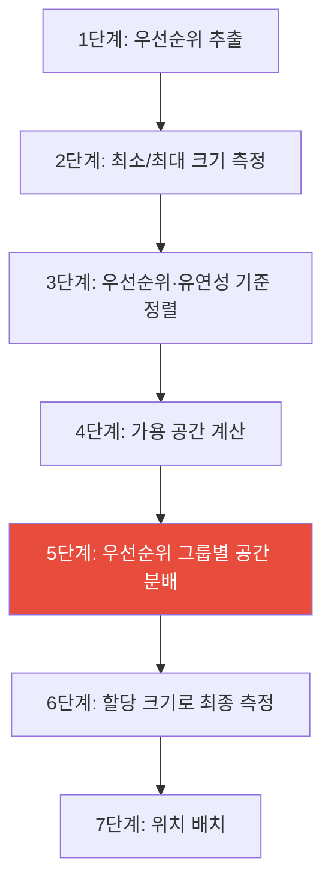

# SkiaUI 레이아웃 시스템 아키텍처

> SwiftUI 호환 ProposedSize 기반 레이아웃 엔진의 설계와 구현을 상세히 다룹니다.

## 목차

1. [개요](#1-개요)
2. [핵심 자료구조](#2-핵심-자료구조)
3. [레이아웃 협상 모델](#3-레이아웃-협상-모델)
4. [LayoutEngine: 재귀적 레이아웃 해석기](#4-layoutengine-재귀적-레이아웃-해석기)
5. [스택 레이아웃 전략](#5-스택-레이아웃-전략)
6. [Modifier 레이아웃 처리](#6-modifier-레이아웃-처리)
7. [렌더 트리 변환](#7-렌더-트리-변환)
8. [런타임 통합](#8-런타임-통합)
9. [전체 파이프라인 추적 예시](#9-전체-파이프라인-추적-예시)
10. [SwiftUI 호환성 매트릭스](#10-swiftui-호환성-매트릭스)
11. [불변식과 계약](#11-불변식과-계약)
12. [파일 맵](#12-파일-맵)

---

## 1. 개요

SkiaUI의 레이아웃 시스템은 SwiftUI의 레이아웃 협상 모델을 기반으로 설계되었습니다. 핵심 아이디어는 **부모가 제안하고 자식이 응답하는 양방향 크기 협상**입니다.

```
부모 ──(ProposedSize)──> 자식
     <──(LayoutNode)──── 자식
```

### 설계 원칙

| 원칙 | 설명 |
|------|------|
| **제안 기반 협상** | 부모가 `ProposedSize`로 가용 공간을 제안하면, 자식이 실제 사용할 크기를 `LayoutNode`로 응답 |
| **전략 패턴** | VStack, HStack, ZStack 각각이 `LayoutStrategy` 프로토콜을 구현하여 독립적 알고리즘 제공 |
| **우선순위 기반 분배** | 스택 내 자식들의 `layoutPriority`와 유연성(flexibility)에 따라 공간을 순서대로 분배 |
| **nil 의미론** | `ProposedSize`에서 nil은 "이상적 크기를 사용하라"는 의미 (SwiftUI의 unspecified와 동일) |
| **순수 값 타입** | 모든 레이아웃 구조체는 `Equatable`, `Sendable` |

### 레이아웃 파이프라인 흐름

```mermaid
graph LR
    A["View DSL"] -->|ViewToElementConverter| B["Element 트리"]
    B -->|LayoutEngine| C["LayoutNode 트리"]
    C -->|RenderTreeBuilder| D["RenderNode 트리"]
    D -->|DisplayListBuilder| E["DrawCommand 버퍼"]
    E -->|CommandEncoder| F["바이너리 [UInt8]"]

    style A fill:#f5a623,color:#000
    style B fill:#4a90d9,color:#fff
    style C fill:#e74c3c,color:#fff
    style D fill:#4a90d9,color:#fff
    style E fill:#7b68ee,color:#fff
    style F fill:#50c878,color:#000
```



이 문서는 주로 **B → C** 구간, 즉 Element 트리에서 LayoutNode 트리를 생성하는 레이아웃 엔진의 동작을 다룹니다.

---

## 2. 핵심 자료구조

### 2.1 ProposedSize — 크기 제안

> 파일: `Sources/SkiaUILayout/ProposedSize.swift`

SwiftUI의 `_ProposedSize`에 대응하는 타입입니다. 부모가 자식에게 "이만큼의 공간이 있다"고 제안할 때 사용합니다.

```swift
public struct ProposedSize: Equatable, Sendable {
    public var width: Float?   // nil = "이상적 크기 사용"
    public var height: Float?
}
```

#### nil의 의미

ProposedSize에서 각 축의 nil 값은 세 가지 시나리오를 인코딩합니다:

| 값 | 의미 | 자식의 응답 |
|----|------|-----------|
| `nil` | "이상적(intrinsic) 크기를 사용하라" | 고유 크기를 보고 (예: 텍스트의 글리프 폭) |
| `0` | "공간이 없다" | 최소 크기를 보고 (유연성 측정에 활용) |
| `.infinity` | "무제한 공간이 있다" | 최대 크기를 보고 (유연성 측정에 활용) |
| 유한 양수 | "이만큼의 공간이 있다" | 제안 이하의 크기를 보고 |

#### 센티넬 값

```swift
static let zero       = ProposedSize(width: 0, height: 0)         // 최소 크기 측정용
static let unspecified = ProposedSize(width: nil, height: nil)     // 이상적 크기 요청
static let infinity   = ProposedSize(width: .infinity, height: .infinity)  // 최대 크기 측정용
```

이 세 센티넬은 스택 레이아웃에서 각 자식의 **유연성**(flexibility = maxSize - minSize)을 계산할 때 핵심적으로 사용됩니다.

### 2.2 Constraints — 레거시 제약 (브릿지)

> 파일: `Sources/SkiaUILayout/Constraints.swift`

기존 min/max 바운딩 박스 모델과의 하위 호환을 위한 타입입니다.

```swift
public struct Constraints: Equatable, Sendable {
    public var minWidth: Float     // 기본값: 0
    public var maxWidth: Float     // 기본값: .infinity
    public var minHeight: Float
    public var maxHeight: Float
}
```

#### ProposedSize 양방향 변환

```swift
extension Constraints {
    // Constraints → ProposedSize: 무한대는 nil로 변환
    public var proposedSize: ProposedSize {
        ProposedSize(
            width:  maxWidth.isInfinite  ? nil : maxWidth,
            height: maxHeight.isInfinite ? nil : maxHeight
        )
    }

    // ProposedSize → Constraints: nil은 무한대로 변환
    public init(proposed: ProposedSize) {
        self.init(
            minWidth: 0, maxWidth: proposed.width ?? .infinity,
            minHeight: 0, maxHeight: proposed.height ?? .infinity
        )
    }
}
```

이 브릿지 덕분에 기존 `layout(_:constraints:)` API를 호출하면 내부적으로 ProposedSize 기반 엔진이 동작합니다.

### 2.3 LayoutNode — 레이아웃 결과

> 파일: `Sources/SkiaUILayout/LayoutNode.swift`

레이아웃 계산의 출력값입니다. 각 Element에 대해 계산된 위치와 크기를 담습니다.

```swift
public struct LayoutNode: Equatable, Sendable {
    public var x: Float           // 부모 원점 기준 X 좌표
    public var y: Float           // 부모 원점 기준 Y 좌표
    public var width: Float       // 계산된 너비
    public var height: Float      // 계산된 높이
    public var children: [LayoutNode]  // 자식 레이아웃 (Element 계층과 1:1 대응)
}
```

#### 좌표계 규약

- `(x, y)`는 **부모 원점 기준 상대 좌표**
- 절대 좌표는 부모 체인의 오프셋을 누적하여 계산
- `RootHost`가 최종 루트 노드를 뷰포트 중앙에 배치

### 2.4 FrameProperties — 유연 프레임

> 파일: `Sources/SkiaUIElement/Element.swift`

SwiftUI의 `frame(minWidth:idealWidth:maxWidth:...)` 수정자에 대응합니다.

```swift
public struct FrameProperties: Equatable, Sendable {
    public var minWidth: Float?      // 최소 너비 제약
    public var idealWidth: Float?    // 이상적 너비 (proposal이 nil일 때 사용)
    public var maxWidth: Float?      // 최대 너비 제약
    public var minHeight: Float?
    public var idealHeight: Float?
    public var maxHeight: Float?
    public var alignment: Int        // 0-8 인코딩: vAlign * 3 + hAlign
}
```

#### 정렬 인코딩 체계

```
vAlign(세로) × 3 + hAlign(가로)

         leading(0)  center(1)  trailing(2)
top(0)      0           1          2
center(1)   3           4          5
bottom(2)   6           7          8
```

예: `Alignment.center` = 1 × 3 + 1 = **4**, `Alignment.bottomTrailing` = 2 × 3 + 2 = **8**

#### 고정 프레임 vs 유연 프레임

```swift
// 고정 프레임: min == ideal == max
.frame(width: 100, height: 50)
// → FrameProperties(minWidth: 100, idealWidth: 100, maxWidth: 100,
//                    minHeight: 50, idealHeight: 50, maxHeight: 50)

// 유연 프레임: min/max 범위 지정
.frame(minWidth: 50, maxWidth: 200)
// → FrameProperties(minWidth: 50, idealWidth: nil, maxWidth: 200,
//                    minHeight: nil, idealHeight: nil, maxHeight: nil)
```

---

## 3. 레이아웃 협상 모델

### 3.1 LayoutStrategy 프로토콜

> 파일: `Sources/SkiaUILayout/LayoutProtocol.swift`

전략 패턴을 통해 다양한 레이아웃 알고리즘을 플러그 가능하게 합니다.

```swift
public protocol LayoutStrategy: Sendable {
    // 기본 구현: ProposedSize 기반 (구현 의무)
    func layout(children: [Element], proposal: ProposedSize,
                measure: (Element, ProposedSize) -> LayoutNode) -> LayoutNode

    // 레거시: Constraints 기반 (기본 브릿지 제공)
    func layout(children: [Element], constraints: Constraints,
                measure: (Element, Constraints) -> LayoutNode) -> LayoutNode
}
```

`measure` 클로저는 **재귀적 측정 함수**입니다. 스택 전략이 각 자식의 크기를 알아야 할 때 이 클로저를 호출하면 `LayoutEngine.layoutElement`가 재귀적으로 실행됩니다.

```
VStackLayout.layout(children, proposal, measure)
    │
    ├── measure(child[0], ProposedSize(width: 200, height: 0))
    │       └── LayoutEngine.layoutElement(child[0], ...)
    │
    ├── measure(child[1], ProposedSize(width: 200, height: .infinity))
    │       └── LayoutEngine.layoutElement(child[1], ...)
    │
    └── ... (각 자식의 최소/최대 크기 측정)
```

### 3.2 구현체

| 전략 | 파일 | 주축 | 교차축 정렬 |
|------|------|------|------------|
| `VStackLayout` | StackLayout.swift | 세로 (height) | leading/center/trailing |
| `HStackLayout` | StackLayout.swift | 가로 (width) | top/center/bottom |
| `ZStackLayout` | ZStackLayout.swift | 없음 (겹침) | 9방향 정렬 |
| `ScrollViewLayout` | ScrollViewLayout.swift | 스크롤 축 무제한 | 교차축 제약 유지 |

---

## 4. LayoutEngine: 재귀적 레이아웃 해석기

> 파일: `Sources/SkiaUILayout/LayoutEngine.swift`

### 4.1 진입점

```swift
public struct LayoutEngine: Sendable {
    // 레거시 API (내부에서 ProposedSize로 변환)
    public func layout(_ element: Element, constraints: Constraints) -> LayoutNode

    // ProposedSize 기반 API
    public func layout(_ element: Element, proposal: ProposedSize) -> LayoutNode
}
```

### 4.2 Element 유형별 레이아웃 규칙

`layoutElement` 메서드는 Element enum을 패턴 매칭하여 유형별 레이아웃을 계산합니다.

#### `.empty` — 빈 뷰

```
입력: proposal (무시)
출력: LayoutNode(width: 0, height: 0)
```

#### `.text(String, TextProperties)` — 텍스트

```
알고리즘:
1. 고유 크기 추정
   estimatedWidth = fontSize × 0.6 × 글자수
   height = fontSize × 1.2

2. 제안에 따른 크기 결정
   proposal.width가 지정됨 → w = min(estimatedWidth, proposal.width)
   proposal.width가 nil    → w = estimatedWidth (고유 크기 사용)

   proposal.height가 지정됨 → h = min(height, proposal.height)
   proposal.height가 nil    → h = height (고유 크기 사용)

3. 출력: LayoutNode(width: max(0, w), height: max(0, h))
```

핵심: `nil` 제안일 때 텍스트는 자신의 고유(intrinsic) 크기를 보고합니다. 이것이 `fixedSize()`가 작동하는 원리입니다.

#### `.rectangle` — 사각형

```
w = proposal.width ?? 0
h = proposal.height ?? 0
출력: LayoutNode(width: w, height: h)
```

사각형은 고유 크기가 없으므로, 제안된 공간을 그대로 채우거나 제안이 없으면 0을 반환합니다.

#### `.spacer(minLength)` — 간격

```
minLen = minLength ?? 0
w = max(minLen, proposal.width ?? 0)
h = max(minLen, proposal.height ?? 0)
출력: LayoutNode(width: w, height: h)
```

Spacer는 **최대 유연성**을 가집니다:
- 제안된 공간이 있으면 전부 수용
- 최소 길이(minLength) 이상을 보장
- 스택에서 priority가 `-∞`이므로 가장 마지막에 남은 공간을 수령

#### `.container` — 컨테이너 (VStack, HStack, ZStack)

```
1. ContainerLayout에서 적절한 LayoutStrategy 선택
2. strategy.layout(children, proposal, measure) 위임
   measure = { child, p → layoutElement(child, proposal: p) }
3. 전략이 반환한 LayoutNode 그대로 반환
```

#### `.modified` — Modifier 적용

```
layoutModified(inner, modifier, proposal) 위임
```

각 Modifier 유형별 처리는 [6절](#6-modifier-레이아웃-처리)에서 상세히 다룹니다.

---

## 5. 스택 레이아웃 전략

> 파일: `Sources/SkiaUILayout/StackLayout.swift`, `ZStackLayout.swift`

### 5.1 VStackLayout — 우선순위 기반 수직 분배

이것이 SwiftUI 호환 레이아웃의 **핵심 알고리즘**입니다.

#### 7단계 알고리즘



##### 1단계: 우선순위 추출

```swift
static func extractPriority(from element: Element) -> Double {
    switch element {
    case .spacer:
        return -.infinity          // Spacer는 가장 낮은 우선순위
    case .modified(_, .layoutPriority(let p)):
        return p                   // 명시적 우선순위
    case .modified(let inner, _):
        return extractPriority(from: inner)  // modifier 체인 순회
    default:
        return 0                   // 기본 우선순위
    }
}
```

재귀적으로 modifier 체인을 풀어 `layoutPriority`를 찾습니다. 예를 들어:

```swift
Text("Hello")
    .padding(10)
    .layoutPriority(1)
    .background(.blue)
```

이 경우 Element 구조는:
```
.modified(
    .modified(
        .modified(
            .text("Hello", ...),
            .padding(...)
        ),
        .layoutPriority(1)    // ← 여기서 발견
    ),
    .background(...)
)
```

`extractPriority`는 `.background` → `.layoutPriority(1)` 순서로 언래핑하여 우선순위 1을 반환합니다.

##### 2단계: 최소/최대 크기 측정

각 자식의 주축(height) 방향 유연성 범위를 측정합니다:

```
자식 i에 대해:
  minNode = measure(child[i], ProposedSize(width: proposal.width, height: 0))
  maxNode = measure(child[i], ProposedSize(width: proposal.width, height: ∞))

  minSizes[i] = minNode.height   // 공간 0일 때의 높이
  maxSizes[i] = maxNode.height   // 무한 공간일 때의 높이
```

| 요소 유형 | minSize (height=0 제안) | maxSize (height=∞ 제안) | 유연성 |
|-----------|------------------------|------------------------|--------|
| Text | fontSize×1.2 (텍스트는 축소 불가) | fontSize×1.2 | 0 (고정) |
| Spacer(nil) | 0 | ∞ | ∞ (최대 유연) |
| Spacer(minLength: 10) | 10 | ∞ | ∞ |
| Rectangle | 0 | ∞ | ∞ |
| .frame(height: 50) | 50 | 50 | 0 (고정) |

##### 3단계: 우선순위·유연성 기준 정렬

```
정렬 기준:
  1차: 우선순위 내림차순 (높은 것이 먼저)
  2차: 같은 우선순위 내에서 유연성 오름차순 (유연하지 않은 것이 먼저)
```

예시:

| 자식 | 우선순위 | 유연성 | 정렬 순서 |
|------|---------|--------|----------|
| Text "A" (layoutPriority: 1) | 1 | 0 | 1번째 |
| Text "B" | 0 | 0 | 2번째 |
| Rectangle | 0 | ∞ | 3번째 |
| Spacer | -∞ | ∞ | 4번째 |

##### 4단계: 가용 공간 계산

```
totalSpacing = spacing × (자식수 - 1)
totalAvailable = (proposal.height ?? ∞) - totalSpacing
totalMinSize = Σ minSizes[i]
remaining = max(0, totalAvailable - totalMinSize)
```

모든 자식의 최소 크기를 확보한 후, 남은 여유 공간(`remaining`)을 분배합니다.

##### 5단계: 우선순위 그룹별 공간 분배 (핵심)

```
우선순위 그룹을 높은 것부터 순회:

각 그룹 내:
  1. 유연성 오름차순으로 정렬 (덜 유연한 것부터)
  2. 그룹의 남은 공간을 균등 분할

  각 멤버에 대해:
    share = groupRemaining / 미처리 멤버 수
    maxGain = maxSizes[i] - minSizes[i]
    extra = min(share, maxGain)           // 필요한 만큼만 가져감
    allocatedSizes[i] = minSizes[i] + extra
    groupRemaining -= extra
    미처리 멤버 수 -= 1

  다음 그룹으로 남은 공간 전달
```

**왜 유연성이 낮은 것부터 처리하는가?**

유연성이 낮은 자식은 추가 공간을 적게 필요로 합니다. 먼저 확정하면 유연한 자식이 실제 남은 공간을 정확히 파악할 수 있습니다. SwiftUI도 동일한 전략을 사용합니다.

##### 구체적 예시

```
자식: [Text("A"), Spacer(), Text("B").layoutPriority(1)]
proposal.height: 200, spacing: 10

1단계: priorities = [0, -∞, 1]
2단계: minSizes = [16.8, 0, 16.8], maxSizes = [16.8, ∞, 16.8]
3단계: 정렬 → [2(p=1), 0(p=0), 1(p=-∞)]
4단계: totalSpacing=20, totalAvailable=180, totalMin=33.6, remaining=146.4

5단계:
  그룹 p=1 (인덱스 [2]):
    share = 146.4 / 1 = 146.4
    maxGain = 16.8 - 16.8 = 0
    extra = min(146.4, 0) = 0
    allocated[2] = 16.8
    remaining = 146.4

  그룹 p=0 (인덱스 [0]):
    share = 146.4 / 1 = 146.4
    maxGain = 16.8 - 16.8 = 0
    extra = 0
    allocated[0] = 16.8
    remaining = 146.4

  그룹 p=-∞ (인덱스 [1]):
    share = 146.4 / 1 = 146.4
    maxGain = ∞ - 0 = ∞
    extra = min(146.4, ∞) = 146.4
    allocated[1] = 0 + 146.4 = 146.4
    remaining = 0

결과: Text A = 16.8, Spacer = 146.4, Text B = 16.8
      합계 = 16.8 + 146.4 + 16.8 + 20(spacing) = 200 ✓
```

##### 6단계: 할당 크기로 최종 측정

```
각 자식 i에 대해:
  childProposal = ProposedSize(width: proposal.width, height: allocatedSizes[i])
  childNodes[i] = measure(children[i], childProposal)
```

##### 7단계: 위치 배치

```
y = 0
containerWidth = min(max(모든 자식 너비), proposal.width)

각 자식 i에 대해:
  childNodes[i].y = y
  childNodes[i].x = alignment에 따라:
    leading(0):  0
    center(1):   (containerWidth - childWidth) / 2
    trailing(2): containerWidth - childWidth
  y += childNodes[i].height + spacing (마지막 제외)

출력: LayoutNode(width: containerWidth, height: y, children: childNodes)
```

### 5.2 HStackLayout — 수평 분배

VStackLayout과 동일한 7단계 알고리즘을 **축만 교환**하여 사용합니다:

| VStack | HStack |
|--------|--------|
| 주축: height | 주축: width |
| 교차축 정렬: leading/center/trailing | 교차축 정렬: top/center/bottom |
| `ProposedSize(width: pw, height: 0)` 으로 최소 측정 | `ProposedSize(width: 0, height: ph)` 으로 최소 측정 |
| y 좌표 누적 | x 좌표 누적 |

### 5.3 ZStackLayout — 겹침 레이아웃

> 파일: `Sources/SkiaUILayout/ZStackLayout.swift`

ZStack은 우선순위/유연성 분배 없이 단순한 알고리즘을 사용합니다:

```
1. 모든 자식에게 동일한 proposal 전달
   childNodes = children.map { measure($0, proposal) }

2. 바운딩 박스 계산
   maxW = max(모든 자식 너비)
   maxH = max(모든 자식 높이)

3. alignment에 따라 각 자식 배치
   hAlign = alignment % 3
   vAlign = alignment / 3

   각 자식의 (x, y)를 바운딩 박스 내에서 정렬

4. 출력: LayoutNode(width: maxW, height: maxH, children: childNodes)
```

렌더링 순서: 배열의 뒤쪽 자식이 위에 표시됩니다 (Z-order).

---

## 6. Modifier 레이아웃 처리

`LayoutEngine.layoutModified` 메서드가 각 Modifier 유형에 대한 레이아웃 변환을 수행합니다.

### 6.1 레이아웃에 영향을 주는 Modifier

#### `.padding(top, leading, bottom, trailing)`

```
1. 내부 제안 축소
   innerProposal.width  = proposal.width  - leading - trailing  (nil이면 nil 유지)
   innerProposal.height = proposal.height - top - bottom

2. 내부 요소 레이아웃
   inner = layoutElement(element, proposal: innerProposal)

3. 내부 요소 오프셋
   inner.x += leading
   inner.y += top

4. 래퍼 크기 = 내부 크기 + 패딩
   출력: LayoutNode(width: inner.width + L + R,
                    height: inner.height + T + B,
                    children: [inner])
```

**LayoutNode 구조**: 패딩은 자식 배열을 가진 래퍼 노드를 생성합니다.

```
LayoutNode (패딩 래퍼)
  ├─ width: 내부너비 + 좌우패딩
  ├─ height: 내부높이 + 상하패딩
  └─ children: [LayoutNode (내부 요소, x=leading, y=top)]
```

#### `.frame(FrameProperties)`

3단계 해석 알고리즘:

```
1단계: 제안 해석 (resolveFrame)
   각 축에 대해:
   - 제안이 있으면 → 제안 값 사용
   - 제안이 nil이면 → ideal 값 사용 (없으면 0)
   - 결과를 [min, max]로 클램프

2단계: 자식 레이아웃
   childProposal = ProposedSize(width: resolvedW, height: resolvedH)
   child = layoutElement(element, proposal: childProposal)

3단계: 프레임 크기 결정 + 정렬
   frameW = clamp(child.width, min: fp.minWidth, max: fp.maxWidth)
   frameH = clamp(child.height, min: fp.minHeight, max: fp.maxHeight)
   자식을 alignment에 따라 프레임 내에 배치

   출력: LayoutNode(width: frameW, height: frameH, children: [child])
```

**`resolveFrame` 헬퍼 상세**:

```swift
func resolveFrame(proposal: Float?, min: Float?, ideal: Float?, max: Float?) -> Float? {
    // 프레임 제약이 없으면 제안을 그대로 전달
    if min == nil && ideal == nil && max == nil { return proposal }

    let value: Float
    if let p = proposal {
        value = p          // 제안이 있으면 제안 사용
    } else {
        value = ideal ?? 0 // nil 제안이면 ideal 사용
    }

    var result = value
    if let lo = min { result = Swift.max(result, lo) }  // 최소 이상
    if let hi = max { result = Swift.min(result, hi) }  // 최대 이하
    return result
}
```

예시:

| proposal | min | ideal | max | 결과 |
|----------|-----|-------|-----|------|
| 150 | 50 | 100 | 200 | 150 (제안 그대로, 범위 내) |
| 30 | 50 | 100 | 200 | 50 (최소로 클램프) |
| 250 | 50 | 100 | 200 | 200 (최대로 클램프) |
| nil | 50 | 100 | 200 | 100 (ideal 사용) |
| nil | nil | nil | nil | nil (제약 없음, 통과) |

### 6.2 레이아웃에 영향을 주되 구조를 변경하지 않는 Modifier

#### `.font(size, weight)`

```
1. 내부 Element의 텍스트 속성을 변환
   patched = applyFontToElement(element, size, weight)
   - .text → fontSize, fontWeight 업데이트
   - .modified(inner, mod) → 내부 재귀 적용
2. 변환된 요소로 레이아웃
   layoutElement(patched, proposal: proposal)
```

래퍼 노드를 생성하지 않으므로 LayoutNode에 자식이 추가되지 않습니다.

#### `.fixedSize(horizontal, vertical)`

```
true인 축의 proposal을 nil로 대체하여 고유 크기를 사용하게 함

p = ProposedSize(
    width:  horizontal ? nil : proposal.width,
    height: vertical   ? nil : proposal.height
)
layoutElement(element, proposal: p)
```

예시: `Text("Very long text").fixedSize()`
- 좁은 제안(width: 50)을 받아도 nil로 대체 → 텍스트 전체 너비 사용

#### `.layoutPriority(Double)`

```
// 개별 요소 크기에는 영향 없음 (투명)
layoutElement(element, proposal: proposal)
```

우선순위는 스택의 `extractPriority`에서만 참조됩니다.

### 6.3 레이아웃에 영향을 주지 않는 Modifier (투명)

```swift
case .background, .foregroundColor, .onTap,
     .accessibilityLabel, .accessibilityRole,
     .accessibilityHint, .accessibilityHidden:
    return layoutElement(element, proposal: proposal)
```

이 Modifier들은 레이아웃을 그대로 통과시킵니다. 렌더링(`RenderTreeBuilder`) 또는 접근성(`SemanticsTreeBuilder`) 단계에서만 처리됩니다.

### 6.4 Modifier 분류 요약

```
┌─────────────────────────────────────────────────┐
│         Modifier 레이아웃 영향 분류              │
├──────────────────┬──────────────────────────────┤
│ 래퍼 생성        │ padding, frame               │
│ (children 배열)  │ → LayoutNode에 자식 추가      │
├──────────────────┼──────────────────────────────┤
│ 제안 변환        │ fixedSize                     │
│ (children 없음)  │ → nil로 대체하여 고유 크기    │
├──────────────────┼──────────────────────────────┤
│ 요소 변환        │ font                          │
│ (children 없음)  │ → Element 속성 직접 변경      │
├──────────────────┼──────────────────────────────┤
│ 메타데이터       │ layoutPriority                │
│ (스택에서만 참조)│ → extractPriority로 추출      │
├──────────────────┼──────────────────────────────┤
│ 투명             │ background, foregroundColor,  │
│ (레이아웃 무관)  │ onTap, accessibility*         │
└──────────────────┴──────────────────────────────┘
```

---

## 7. 렌더 트리 변환

> 파일: `Sources/SkiaUIRenderTree/RenderTreeBuilder.swift`

`RenderTreeBuilder`는 Element 트리와 LayoutNode 트리를 동시에 순회하며 `RenderNode` 트리를 생성합니다.

### 7.1 레이아웃 노드 매핑 규칙

```
Element 유형          LayoutNode 해석           RenderNode 생성
─────────────────────────────────────────────────────────
.empty               그대로 사용               빈 프레임
.text                그대로 사용               TextContent 포함
.rectangle           그대로 사용               PaintStyle 포함
.spacer              그대로 사용               빈 프레임
.container           children 1:1 매핑         재귀적 자식 빌드
.modified(.padding)  layout.children[0] = 내부  래퍼 + 내부 자식
.modified(.frame)    layout.children[0] = 내부  래퍼 + 내부 자식
.modified(.background) 그대로 사용             배경 사각형 + 내부
.modified(투명)       그대로 사용              내부 그대로 반환
```

### 7.2 색상 상속 모델

`foregroundColor` Modifier는 색상을 하위 트리로 전파합니다:

```
buildNode(element, layout, inheritedColor: UInt32)
                                    ↑
                    기본값: 0xFF000000 (검정)

.foregroundColor(.blue) 발견 시:
  inheritedColor = 0xFF0000FF
  → 이후 모든 하위 Text에 적용

.text 노드에서:
  color = props.foregroundColor?.uint32 ?? inheritedColor
```

---

## 8. 런타임 통합

> 파일: `Sources/SkiaUIRuntime/RootHost.swift`

### 8.1 렌더링 파이프라인

```swift
public func render<V: View>(_ view: V) {
    // 1. View → Element
    let element = ViewToElementConverter.convert(view)

    // 2. Element → LayoutNode (ProposedSize 진입점)
    var layout = layoutEngine.layout(element,
        proposal: ProposedSize(width: viewportWidth, height: viewportHeight))

    // 3. 뷰포트 중앙 배치 (SwiftUI 루트 뷰 동작)
    layout.x = (viewportWidth - layout.width) / 2
    layout.y = (viewportHeight - layout.height) / 2

    // 4. LayoutNode + Element → RenderNode
    let renderNode = RenderTreeBuilder().build(element: element, layout: layout)

    // 5. RenderNode → DisplayList → [UInt8]
    let displayList = DisplayListBuilder().build(from: renderNode)
    let bytes = CommandEncoder().encode(displayList)

    // 6. 콜백으로 전달
    onDisplayList?(bytes)
}
```

### 8.2 히트 테스트

```swift
public func hitTest(x: Float, y: Float) -> Int?
```

히트 테스트는 레이아웃 트리를 역순(Z-order)으로 DFS 순회합니다:

```
hitTestElement(element, layout, x, y, offsetX, offsetY):
  1. 절대 좌표 계산: absX = offsetX + layout.x
  2. 바운드 체크: 점이 노드 영역 밖이면 nil 반환
  3. 자식 역순 탐색 (위에 보이는 것부터):
     - container: children.reversed()에서 재귀 탐색
     - modified(padding/frame): layout.children[0]에서 내부 탐색
     - modified(기타): layout 그대로 내부 탐색
  4. onTap(id) Modifier 발견 시 id 반환
  5. 발견 못 하면 nil 반환
```

**래퍼 Modifier 구분 규칙**:

| Modifier | innerLayout |
|----------|-------------|
| `.padding`, `.frame` | `layout.children.first ?? layout` (래퍼의 첫 자식) |
| 기타 모든 Modifier | `layout` 그대로 (래퍼 없음) |

---

## 9. 전체 파이프라인 추적 예시

다음 뷰의 레이아웃 과정을 단계별로 추적합니다:

```swift
HStack(spacing: 0) {
    Text("Left")
        .padding(8)
        .background(.blue)
    Spacer()
    Text("Right")
        .padding(8)
        .background(.red)
}
.frame(width: 300)
```

### Element 트리

```
.modified(
    .container(.hstack(spacing: 0, alignment: 1), children: [
        .modified(.modified(.text("Left", props), .padding(8,8,8,8)), .background(.blue)),
        .spacer(nil),
        .modified(.modified(.text("Right", props), .padding(8,8,8,8)), .background(.red)),
    ]),
    .frame(FrameProperties(minWidth: 300, idealWidth: 300, maxWidth: 300))
)
```

### 레이아웃 추적

```
루트: layoutModified(.frame)
  ├─ resolveFrame(proposal.width, min:300, ideal:300, max:300) → 300
  ├─ childProposal = ProposedSize(width: 300, height: proposal.height)
  │
  └─ layoutElement(.container .hstack)
     └─ HStackLayout.layout(children: 3개, proposal: (300, ph))

       [2단계: 최소/최대 측정]
       자식 0 (.background(.padding(.text("Left")))):
         measure(width: 0)  → padding(0+16, 16.8+16) → minSize.width = 16
         measure(width: ∞)  → padding(42+16, 16.8+16) → maxSize.width = 58
       자식 1 (.spacer):
         measure(width: 0)  → 0
         measure(width: ∞)  → ∞
       자식 2 (.background(.padding(.text("Right")))):
         measure(width: 0)  → 16
         measure(width: ∞)  → 58.8

       [3단계: 정렬]
       priorities = [0, -∞, 0]
       sorted = [0(flex=42), 2(flex=42.8), 1(flex=∞)]

       [4·5단계: 공간 분배]
       totalAvailable = 300, totalMinSize = 32, remaining = 268

       그룹 p=0 [0, 2]:
         유연성 순: [0(42), 2(42.8)]
         인덱스 0: share=268/2=134, extra=min(134,42)=42, alloc=58, rem=226
         인덱스 2: share=226/1=226, extra=min(226,42.8)=42.8, alloc=58.8, rem=183.2

       그룹 p=-∞ [1]:
         인덱스 1: share=183.2, extra=183.2, alloc=183.2

       [6단계: 최종 측정]
       자식 0: proposal(58, ph) → padding(42+16=58, 33.6) → w=58
       자식 1: proposal(183.2, ph) → spacer w=183.2
       자식 2: proposal(58.8, ph) → padding(42.8+16=58.8, 33.6) → w=58.8

       [7단계: 위치 배치]
       자식 0: x=0
       자식 1: x=58
       자식 2: x=58+183.2=241.2

       HStack 결과: width=300, height=33.6

  frame 래퍼: width=300, height=33.6, child 중앙 정렬
```

### 최종 LayoutNode 구조

```
LayoutNode(x: 250, y: 283.2, w: 300, h: 33.6)  // 뷰포트 중앙
└── LayoutNode(x: 0, y: 0, w: 300, h: 33.6)    // frame 내부
    ├── LayoutNode(x: 0, y: 0, w: 58, h: 33.6)        // "Left" + padding
    │   └── LayoutNode(x: 8, y: 8, w: 42, h: 16.8)   // "Left" 텍스트
    ├── LayoutNode(x: 58, y: 0, w: 183.2, h: 33.6)    // Spacer
    └── LayoutNode(x: 241.2, y: 0, w: 58.8, h: 33.6)  // "Right" + padding
        └── LayoutNode(x: 8, y: 8, w: 42.8, h: 16.8) // "Right" 텍스트
```

---

## 10. SwiftUI 호환성 매트릭스

| 기능 | SwiftUI | SkiaUI | 비고 |
|------|---------|--------|------|
| ProposedSize (nil 의미론) | `_ProposedSize` | `ProposedSize` | 동일 |
| 우선순위 기반 스택 분배 | `layoutPriority(_:)` | `layoutPriority(_:)` | 동일한 알고리즘 |
| Spacer 우선순위 | 가장 낮음 | `-∞` | 동일 동작 |
| 유연성 기반 정렬 (덜 유연한 것 먼저) | O | O | SwiftUI 리버스 엔지니어링 기반 |
| 고정 프레임 (width/height) | `frame(width:height:)` | `frame(width:height:)` | 동일 API |
| 유연 프레임 (min/ideal/max) | `frame(minWidth:idealWidth:maxWidth:...)` | 동일 | 동일 API |
| fixedSize | `fixedSize()` | `fixedSize()` | 동일 |
| padding | `padding(_:)` | `padding(_:)` | 동일 |
| VStack/HStack alignment | `.leading/.center/.trailing` | Int 인코딩 | 동일 결과 |
| ZStack 9방향 정렬 | `Alignment` 구조체 | Int 인코딩 (0-8) | 동일 결과 |
| 루트 뷰 중앙 배치 | 자동 | `RootHost`에서 수동 | 동일 결과 |
| GeometryReader | O | X | 미구현 |
| alignmentGuide | O | X | 미구현 |
| 커스텀 Layout 프로토콜 | O | `LayoutStrategy` | 유사 (API 차이) |

---

## 11. 불변식과 계약

### 크기 불변식

1. **비음수 보장**: 모든 `LayoutNode`의 width, height ≥ 0
2. **제안 존중**: 유한한 proposal에 대해 반환 크기 ≤ 제안 크기
3. **계층 일치**: `LayoutNode.children.count` == 해당 Element의 자식 수

### 스택 분배 불변식

1. **우선순위 순서**: 높은 우선순위 그룹이 반드시 먼저 공간 확보
2. **최소 크기 보장**: 모든 자식은 최소 `minSize` 이상의 공간 확보
3. **스페이싱 정확성**: 총 스페이싱 = `spacing × (자식수 - 1)`
4. **총합 일치**: Σ(allocatedSizes) + totalSpacing ≤ totalAvailable

### Modifier 계약

1. **래퍼 Modifier** (padding, frame): LayoutNode에 `children` 배열 생성
2. **투명 Modifier**: LayoutNode 구조 변경 없음
3. **합성 순서**: 나중에 적용된 Modifier가 바깥쪽을 감쌈

### 좌표계 계약

1. **(x, y)는 부모 기준 상대 좌표**
2. 절대 좌표 = 조상 체인의 (x, y) 누적 합
3. 루트 LayoutNode의 (x, y)는 `RootHost`가 뷰포트 중앙 기준으로 설정

---

## 12. 파일 맵

```
Sources/SkiaUILayout/
  ├── ProposedSize.swift        SwiftUI 호환 제안 크기 타입
  ├── Constraints.swift         레거시 제약 + ProposedSize 브릿지
  ├── LayoutProtocol.swift      LayoutStrategy 프로토콜 (전략 패턴)
  ├── LayoutEngine.swift        재귀적 레이아웃 해석기 (핵심)
  ├── StackLayout.swift         VStackLayout, HStackLayout (우선순위 분배)
  ├── ZStackLayout.swift        ZStackLayout (겹침 정렬)
  ├── ScrollViewLayout.swift    ScrollViewLayout (스크롤 축 무제한)
  └── LayoutNode.swift          레이아웃 결과 (위치+크기 트리)

Sources/SkiaUIElement/
  └── Element.swift             Element enum, FrameProperties, Modifier enum

Sources/SkiaUIDSL/Modifiers/
  ├── FrameModifier.swift       고정/유연 frame() DSL
  ├── LayoutPriorityModifier.swift  layoutPriority() DSL
  ├── FixedSizeModifier.swift   fixedSize() DSL
  └── PaddingModifier.swift     padding() DSL

Sources/SkiaUIRenderTree/
  └── RenderTreeBuilder.swift   LayoutNode → RenderNode 변환

Sources/SkiaUIRuntime/
  └── RootHost.swift            전체 파이프라인 오케스트레이션

Tests/SkiaUILayoutTests/
  ├── LayoutTests.swift         레이아웃 엔진 테스트 (12개)
  └── ProposedSizeTests.swift   ProposedSize 타입 테스트 (11개)
```
