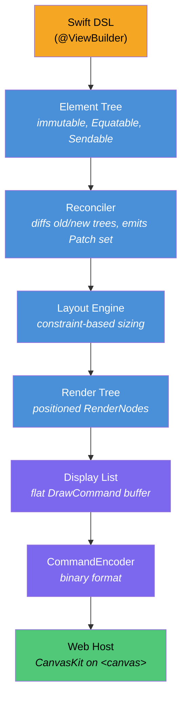
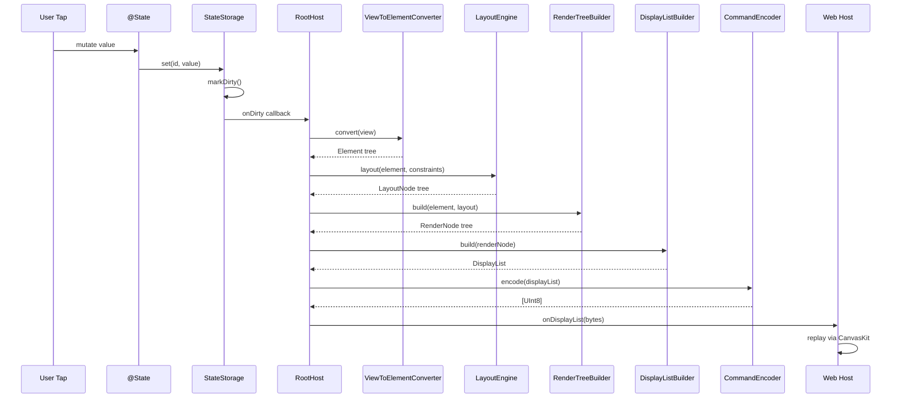
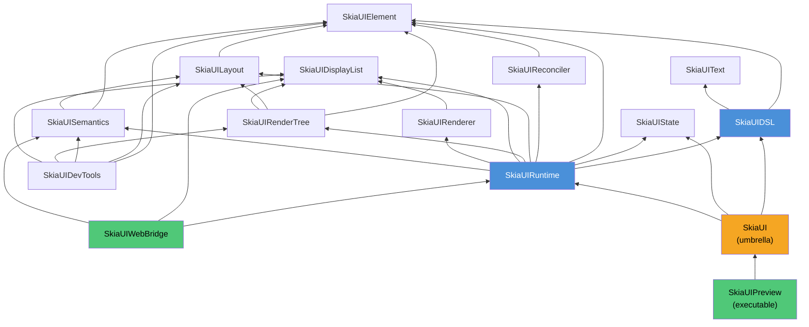

# SkiaUI

A declarative UI engine written in Swift that renders to [Skia (CanvasKit)](https://skia.org/docs/user/modules/canvaskit/) on the web. Write SwiftUI-style code, render pixel-perfect UI on an HTML Canvas.

**[한국어](/ko/)** | **[日本語](/ja/)** | **[中文](/zh/)**

```swift
struct CounterView: View {
    @State private var count = 0

    var body: some View {
        VStack(spacing: 16) {
            Text("Count: \(count)")
                .font(size: 32)
                .foregroundColor(.blue)

            HStack(spacing: 16) {
                Text("- Decrease")
                    .padding(12)
                    .background(.red)
                    .foregroundColor(.white)
                    .onTapGesture { count -= 1 }

                Text("+ Increase")
                    .padding(12)
                    .background(.blue)
                    .foregroundColor(.white)
                    .onTapGesture { count += 1 }
            }
        }
        .padding(32)
    }
}
```

## Why SkiaUI

Swift developers who want to build web UI currently face a trade-off: either switch to a JavaScript-based stack or accept DOM-centric rendering with limited control.

SkiaUI takes a different path:

- **Swift as the single UI language** -- declarative ResultBuilder DSL, `@State`, modifiers
- **Canvas-based rendering** -- not DOM elements, but Skia drawing commands on `<canvas>`
- **Renderer-agnostic core** -- the DSL and layout engine know nothing about CanvasKit; a native Skia or Metal backend can be added without changing user code

## Architecture

The core design principle is **strict separation between declaration, computation, and drawing**. The DSL never talks to a renderer. The renderer never parses view code. A binary display list sits at the boundary.



Each layer is a separate Swift module with explicit dependency boundaries defined in `Package.swift`. Replacing or testing any single layer does not require the others.

### Data flow on state change



### Module dependency graph



## Module Map

```text
SkiaUI (umbrella)
  @_exported import SkiaUIDSL
  @_exported import SkiaUIState
  @_exported import SkiaUIRuntime

SkiaUIDSL           -> [SkiaUIElement, SkiaUIText]
  View protocol, @ViewBuilder, PrimitiveView protocol
  Primitives:   Text, Rectangle, Spacer, EmptyView
  Containers:   VStack, HStack, ZStack, ScrollView
  Modifiers:    padding, frame, background, foregroundColor, font,
                onTapGesture, accessibilityLabel/Role/Hint/Hidden
  Types:        Color, Alignment, EdgeInsets, Rect, Axis
  AnyView, ConditionalView, TupleView2, ViewToElementConverter

SkiaUIElement       -> (no deps)
  Element (indirect enum), ElementID, ElementTree

SkiaUIText          -> (no deps)
  FontDescriptor, FontWeight, TextStyle, ParagraphSpec

SkiaUIState         -> (no deps)
  @State, Binding, StateStorage, ScrollOffsetStorage, Environment, Scheduler

SkiaUIReconciler    -> [SkiaUIElement]
  Reconciler, Patch, ElementPath, DirtyTracker

SkiaUILayout        -> [SkiaUIElement]
  LayoutEngine, LayoutNode, Constraints
  LayoutStrategy protocol, VStackLayout, HStackLayout, ZStackLayout, ScrollViewLayout

SkiaUIRenderTree    -> [SkiaUIElement, SkiaUILayout, SkiaUIDisplayList]
  RenderNode, RenderTreeBuilder, DisplayListBuilder
  PaintStyle, TextContent, Transform, Clip

SkiaUIDisplayList   -> (no deps)
  DisplayList, DrawCommand, CommandEncoder, RetainedSubtree

SkiaUIRenderer      -> [SkiaUIDisplayList]
  RendererBackend protocol, RendererConfig, TextMetrics

SkiaUISemantics     -> [SkiaUIElement, SkiaUILayout]
  SemanticsNode, SemanticsTreeBuilder, SemanticsRole
  SemanticsAction, SemanticsUpdate

SkiaUIRuntime       -> [SkiaUIDSL, SkiaUIState, SkiaUIElement,
                        SkiaUIReconciler, SkiaUILayout, SkiaUIRenderTree,
                        SkiaUIDisplayList, SkiaUIRenderer, SkiaUISemantics]
  App protocol, RootHost, FrameLoop

SkiaUIWebBridge     -> [SkiaUIRuntime, SkiaUIDisplayList, SkiaUISemantics]
  WebBridge, JSHostBinding, DisplayListExport, SemanticsExport
  (JavaScriptKit dependency -- isolated here, Wasm only)

SkiaUIDevTools      -> [SkiaUIElement, SkiaUILayout, SkiaUISemantics,
                        SkiaUIRenderTree, SkiaUIDisplayList]
  TreeInspector, DebugOverlay, SemanticsInspector

SkiaUIPreview       -> [SkiaUI]  (executable target)
  HTTP server serving display list to WebHost for browser preview
```

No external dependencies for the core modules. `JavaScriptKit` is only needed by `SkiaUIWebBridge` for WebAssembly builds.

## Key Design Decisions

### Element as an indirect enum

```swift
public indirect enum Element: Equatable, Sendable {
    case empty
    case text(String, TextProperties)
    case rectangle(RectangleProperties)
    case spacer(minLength: Float?)
    case container(ContainerProperties, children: [Element])
    case modified(Element, Modifier)
}
```

The entire UI tree is a single, value-type, `Equatable` structure. This makes diffing trivial, serialization straightforward, and snapshot testing natural. No reference types, no identity management at the element level.

`Element.Modifier` encodes every modifier as a flat enum case:

```swift
public enum Modifier: Equatable, Sendable {
    case padding(top: Float, leading: Float, bottom: Float, trailing: Float)
    case frame(width: Float?, height: Float?, alignment: Int)
    case background(ElementColor)
    case foregroundColor(ElementColor)
    case font(size: Float, weight: Int)
    case onTap(id: Int)
    case accessibilityLabel(String)
    case accessibilityRole(String)
    case accessibilityHint(String)
    case accessibilityHidden(Bool)
}
```

### Constraint-based layout

```swift
public struct Constraints: Equatable, Sendable {
    var minWidth, maxWidth, minHeight, maxHeight: Float

    func constrain(width: Float, height: Float) -> (width: Float, height: Float)
    func inset(top:leading:bottom:trailing:) -> Constraints
    func withExactWidth(_ width: Float) -> Constraints
    func withExactHeight(_ height: Float) -> Constraints
}

public protocol LayoutStrategy: Sendable {
    func layout(children: [Element], constraints: Constraints,
                measure: (Element, Constraints) -> LayoutNode) -> LayoutNode
}
```

Each stack type (`VStackLayout`, `HStackLayout`, `ZStackLayout`) implements `LayoutStrategy`. The engine proposes constraints downward, children report sizes upward. Spacers absorb remaining space. Layout-affecting modifiers (`padding`, `frame`) wrap inner layout as children; transparent modifiers (`background`, `foregroundColor`, `onTap`, `font`, accessibility) pass layout through unchanged.

### Display list as the rendering boundary

```swift
public enum DrawCommand: Equatable, Sendable {
    case save
    case restore
    case translate(x: Float, y: Float)
    case clipRect(x: Float, y: Float, width: Float, height: Float)
    case drawRect(x: Float, y: Float, width: Float, height: Float, color: UInt32)
    case drawRRect(x: Float, y: Float, width: Float, height: Float, radius: Float, color: UInt32)
    case drawText(text: String, x: Float, y: Float, fontSize: Float,
                  fontWeight: Int, color: UInt32, boundsWidth: Float)
    case retainedSubtreeBegin(id: Int, version: Int)
    case retainedSubtreeEnd
}
```

The display list is the **only thing that crosses the Swift-JavaScript boundary**. `CommandEncoder` serializes it into a compact binary format:

| Field | Format | Size |
| ----- | ------ | ---- |
| Header version | `Int32` | 4 bytes |
| Header command count | `Int32` | 4 bytes |
| Command opcode | `UInt8` | 1 byte |
| Command params | `Float32` / `Int32` / `UInt32` / length-prefixed UTF-8 | variable |

Opcodes are 1-9, all values little-endian. The TypeScript `DisplayListPlayer` reads this format directly from an `ArrayBuffer` and replays it as CanvasKit API calls -- zero object marshalling, zero JSON parsing.

### Render tree

```swift
public final class RenderNode: @unchecked Sendable {
    var frame: (x: Float, y: Float, width: Float, height: Float)
    var paintStyle: PaintStyle?        // fillColor: UInt32?, cornerRadius: Float
    var textContent: TextContent?      // text, fontSize, fontWeight, color (ARGB UInt32)
    var children: [RenderNode]
    var clipToBounds: Bool
}
```

`RenderTreeBuilder` walks the `Element` tree alongside the `LayoutNode` tree to produce positioned `RenderNode`s. `DisplayListBuilder` then emits draw commands from the render tree using save/translate/draw/restore patterns.

### Reconciler

```swift
public enum Patch: Equatable, Sendable {
    case insert(path: ElementPath, element: Element)
    case delete(path: ElementPath)
    case update(path: ElementPath, from: Element, to: Element)
    case replace(path: ElementPath, from: Element, to: Element)
}
```

`ElementPath` encodes tree position as `[Int]` indices. `DirtyTracker` marks paths and their ancestors for targeted re-layout.

### Reactive state

```swift
@propertyWrapper
public struct State<Value: Sendable>: Sendable where Value: Equatable {
    public var wrappedValue: Value { get nonmutating set }
    public var projectedValue: Binding<Value> { get }
}
```

`@State` is backed by a global `StateStorage` (thread-safe, `NSLock`-protected). On mutation, it compares old vs new values; only actual changes trigger `markDirty()`, which fires the `onDirty` callback to re-render. `RootHost` connects this callback to trigger a full render pass.

### ViewBuilder (SE-0348)

```swift
@resultBuilder
public struct ViewBuilder {
    static func buildBlock() -> EmptyView
    static func buildPartialBlock<V: View>(first: V) -> V
    static func buildPartialBlock<A: View, V: View>(accumulated: A, next: V) -> TupleView2<A, V>
    static func buildOptional<V: View>(_ component: V?) -> ConditionalView<V, EmptyView>
    static func buildEither<T: View, F: View>(first: T) -> ConditionalView<T, F>
    static func buildEither<T: View, F: View>(second: F) -> ConditionalView<T, F>
}
```

Uses `buildPartialBlock` (SE-0348) for unlimited children support. `TupleView2` flattens nested pairs into flat child arrays via `TupleViewProtocol`. `ConditionalView` handles `if`/`else if`/`else` chains through nested `buildEither` calls.

## DSL Surface

### Primitives

| View | Description |
| ---- | ----------- |
| `Text("Hello")` | Styled text node |
| `Rectangle()` | Solid or rounded rectangle |
| `Spacer()` | Flexible space in stacks |
| `EmptyView()` | Zero-size placeholder |

### Containers

| View | Description |
| ---- | ----------- |
| `VStack(alignment:spacing:)` | Vertical layout (alignment: `.leading`, `.center`, `.trailing`) |
| `HStack(alignment:spacing:)` | Horizontal layout (alignment: `.top`, `.center`, `.bottom`) |
| `ZStack(alignment:)` | Overlay/layered layout (9-point alignment) |
| `ScrollView(_:)` | Scrollable container (`.vertical` or `.horizontal`) |

### View modifiers

| Modifier | Example |
| -------- | ------- |
| `.padding(_:)` | `.padding(16)` or `.padding(top: 8, leading: 16, bottom: 8, trailing: 16)` |
| `.frame(width:height:)` | `.frame(width: 200, height: 100)` |
| `.background(_:)` | `.background(.blue)` |
| `.foregroundColor(_:)` | `.foregroundColor(.white)` |
| `.font(size:weight:)` | `.font(size: 24, weight: .bold)` |
| `.onTapGesture { }` | `.onTapGesture { count += 1 }` |
| `.accessibilityLabel(_:)` | `.accessibilityLabel("Close button")` |
| `.accessibilityRole(_:)` | `.accessibilityRole("button")` |
| `.accessibilityHint(_:)` | `.accessibilityHint("Double tap to close")` |
| `.accessibilityHidden(_:)` | `.accessibilityHidden(true)` |

### Rectangle-specific modifiers

| Modifier | Example |
| -------- | ------- |
| `.fill(_:)` | `Rectangle().fill(.red)` |
| `.cornerRadius(_:)` | `Rectangle().fill(.orange).cornerRadius(12)` |

### Types

| Type | Values |
| ---- | ------ |
| `Color` | `.red`, `.blue`, `.green`, `.orange`, `.purple`, `.yellow`, `.gray`, `.black`, `.white`, `.clear` |
| `Color(red:green:blue:)` | `Color(red: 0.2, green: 0.6, blue: 0.9)` |
| `Color(white:)` | `Color(white: 0.75)` |
| `FontWeight` | `.ultraLight`, `.thin`, `.light`, `.regular`, `.medium`, `.semibold`, `.bold`, `.heavy`, `.black` |
| `HorizontalAlignment` | `.leading`, `.center`, `.trailing` |
| `VerticalAlignment` | `.top`, `.center`, `.bottom` |

## Web Host

The TypeScript web host (`WebHost/`) is intentionally thin. Its only job is:

1. **Bootstrap** -- load CanvasKit WASM, create a WebGL-backed `<canvas>`, load fonts
2. **Replay** -- read the binary display list and call CanvasKit draw methods
3. **Forward events** -- send pointer/click coordinates back to Swift for hit testing
4. **Sync viewport** -- notify Swift on browser resize

The host has no knowledge of the UI tree, layout, or state. It is a display list player.

```text
WebHost/
  package.json              canvaskit-wasm, vite, typescript
  vite.config.ts
  index.html
  src/
    main.ts                 Entry point
    bootstrap.ts            CanvasKit initialization sequence
    canvaskitHost.ts        Surface creation, frame loop, viewport sync
    canvaskitBackend.ts     Canvas API wrapper
    displayListPlayer.ts    Binary buffer -> CanvasKit API calls
    eventBridge.ts          Pointer/click event delegation
    debugOverlay.ts         FPS and debug visualization
    semanticsOverlay.ts     Accessibility tree overlay
```

`displayListPlayer.ts` reads the binary format emitted by Swift's `CommandEncoder` directly from an `ArrayBuffer`. It maps opcodes to CanvasKit calls: `drawRect`, `drawRRect`, `drawText` (with glyph-width-based centering), `save`, `restore`, `translate`, `clipRect`. Colors are decoded from ARGB `UInt32` to CanvasKit `Color4f`.

## Project Structure

```text
SkiaUI/
  Package.swift
  Sources/
    SkiaUI/                    Umbrella module (single import)
    SkiaUIDSL/
      View.swift               View protocol, AnyView
      ViewBuilder.swift        @resultBuilder, TupleView2, ConditionalView
      ViewToElement.swift      View -> Element conversion
      PrimitiveView.swift      PrimitiveView protocol
      Primitives/              Text, Rectangle, Spacer, EmptyView
      Containers/              VStack, HStack, ZStack, ScrollView
      Modifiers/               8 files (padding, frame, background, foreground,
                               font, onTap, accessibility, modifiedContent)
      Types/                   Color, Alignment, EdgeInsets, Rect
    SkiaUIElement/             Element enum, ElementID, ElementTree
    SkiaUIText/                FontDescriptor, FontWeight, TextStyle, ParagraphSpec
    SkiaUIState/               @State, Binding, StateStorage, Environment, Scheduler
    SkiaUIReconciler/          Reconciler, Patch, DirtyTracker
    SkiaUILayout/              LayoutEngine, LayoutNode, Constraints,
                               LayoutStrategy, VStack/HStack/ZStackLayout
    SkiaUIRenderTree/          RenderNode, RenderTreeBuilder, DisplayListBuilder,
                               PaintStyle, Transform, Clip
    SkiaUIDisplayList/         DisplayList, DrawCommand, CommandEncoder, RetainedSubtree
    SkiaUIRenderer/            RendererBackend, RendererConfig, TextMetrics
    SkiaUISemantics/           SemanticsNode, SemanticsTreeBuilder, SemanticsRole,
                               SemanticsAction, SemanticsUpdate
    SkiaUIRuntime/             App protocol, RootHost, FrameLoop
    SkiaUIWebBridge/           WebBridge, JSHostBinding, DisplayListExport, SemanticsExport
    SkiaUIDevTools/            TreeInspector, DebugOverlay, SemanticsInspector
    SkiaUIPreview/             main.swift (HTTP server + example dashboard)
  WebHost/                     TypeScript CanvasKit host (Vite)
  Examples/
    CounterApp/                Interactive counter demo
    AccessibilityDemo/         Accessibility modifiers demo
  Tests/
    SkiaUIDSLTests/            ViewBuilder composition tests
    SkiaUIElementTests/        Element tree tests
    SkiaUILayoutTests/         Layout engine tests
    SkiaUIReconcilerTests/     Diff/patch tests
    SkiaUIDisplayListTests/    Encoding round-trip tests
    SkiaUISemanticsTests/      Accessibility tree tests
    SkiaUIStateTests/          State management tests
    GoldenTests/               Visual regression test framework
  CLI/                         skui dev CLI (build, dev, test, lint)
```

## Getting Started

### Prerequisites

- Swift 6.2+
- macOS 14.0+
- Node.js / pnpm (for web host)

### Build & Run

```bash
# Build all modules
swift build

# Run tests (96 tests across 12 suites)
swift test

# Start the preview server (serves display list over HTTP on :3001)
swift run SkiaUIPreview

# In another terminal, start the web host dev server
cd WebHost && pnpm install && pnpm dev
```

Open `http://localhost:5173` in a browser. The dashboard shows 5 example views -- Counter, Typography, Shapes & Colors, Layout, and Accessibility -- demonstrating the full DSL surface.

## Project Status

SkiaUI is in early development. The current implementation covers:

- [x] ResultBuilder DSL with `@ViewBuilder` (SE-0348 `buildPartialBlock`)
- [x] 4 primitive views (`Text`, `Rectangle`, `Spacer`, `EmptyView`)
- [x] 4 container views (`VStack`, `HStack`, `ZStack`, `ScrollView`)
- [x] 12 view modifiers + 2 Rectangle-specific modifiers
- [x] `@State` reactivity with automatic re-rendering
- [x] Constraint-based layout engine with pluggable `LayoutStrategy`
- [x] Tree reconciliation with minimal diffing (`Patch`, `DirtyTracker`)
- [x] Binary display list encoding/decoding (`CommandEncoder`)
- [x] CanvasKit web rendering via TypeScript host
- [x] Tap/click event handling with z-order-correct hit testing
- [x] Accessibility semantics tree (`SemanticsNode`, `SemanticsTreeBuilder`)
- [x] 96 tests across 12 suites

### Roadmap

- [ ] List
- [ ] Animation system
- [ ] Image support
- [ ] Keyboard / focus management
- [ ] Accessibility DOM overlay
- [ ] Native Skia backend (Metal / Vulkan)
- [ ] Hot reload

## License

MIT
