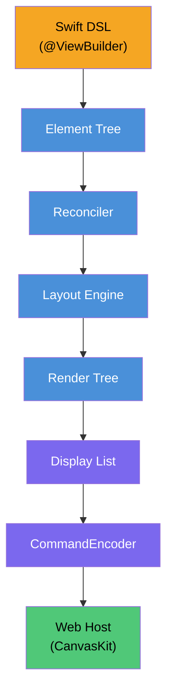

<p align="center">
  
</p>

# SkiaUI

Swiftで書く宣言型UIエンジン。Webでは[Skia (CanvasKit)](https://skia.org/docs/user/modules/canvaskit/)でレンダリングします。

SwiftUIスタイルのコードを書き、HTML `<canvas>` 上にピクセル単位で正確なUIを描画します。

**[English](../README.md)** | **[한국어](README_ko.md)** | **[中文](README_zh.md)** | **[Documentation](https://devyhan.github.io/SkiaUI/)**

> [!IMPORTANT]
> SkiaUIは現在**実験段階**です。APIは不安定であり、予告なく変更される可能性があります。本番環境での使用は推奨しません。

```swift
struct CounterView: View {
    @State private var count = 0

    var body: some View {
        VStack(spacing: 16) {
            Text("Count: \(count)")
                .font(size: 32)
                .foregroundColor(.blue)

            HStack(spacing: 16) {
                Text("- Decrease")
                    .padding(12)
                    .background(.red)
                    .foregroundColor(.white)
                    .onTapGesture { count -= 1 }

                Text("+ Increase")
                    .padding(12)
                    .background(.blue)
                    .foregroundColor(.white)
                    .onTapGesture { count += 1 }
            }
        }
        .padding(32)
    }
}
```

## 目標

- **Swiftを単一のUI言語に** -- 宣言型ResultBuilder DSL、`@State`、modifier
- **Canvasベースレンダリング** -- DOM要素ではなく、Skia描画コマンドで`<canvas>`に直接レンダリング
- **レンダラー非依存コア** -- ネイティブSkiaやMetalバックエンドをユーザーコード変更なしで追加可能

## アーキテクチャ



各レイヤーは独立したSwiftモジュールです。バイナリディスプレイリストが**Swift–JavaScript境界を越える唯一のデータ**であり、JSONパースやオブジェクトマーシャリングはありません。

## 機能状況

| カテゴリ | 機能 | 状態 |
| -------- | ---- | ---- |
| **ビュー** | Text, Rectangle, Spacer, EmptyView | 完了 |
| **コンテナ** | VStack, HStack, ZStack, ScrollView | 完了 |
| **Modifier** | padding, frame, background, foregroundColor, font, fontFamily, onTapGesture | 完了 |
| **タイポグラフィ** | Font構造体 (.custom, .system, セマンティックスタイル)、fontFamilyパイプライン、FontManager | 完了 |
| **レイアウト** | ProposedSizeネゴシエーション、layoutPriority、fixedSize、フレキシブルフレーム (min/ideal/max) | 完了 |
| **状態** | @State, Binding, 自動再レンダリング | 完了 |
| **アクセシビリティ** | accessibilityLabel, accessibilityRole, accessibilityHint, accessibilityHidden | 完了 |
| **レンダリング** | バイナリディスプレイリスト、CanvasKit再生、リテインドサブツリー | 完了 |
| **Reconciler** | ツリーdiff、Patch、DirtyTracker | 完了 |
| **テスト** | 12スイート、119テスト | 完了 |
| **レンダリング** | List | 予定 |
| **レンダリング** | アニメーションシステム | 予定 |
| **レンダリング** | 画像サポート | 予定 |
| **プラットフォーム** | ネイティブSkiaバックエンド (Metal / Vulkan) | 予定 |

## プロダクト

| プロダクト | 説明 |
| ---------- | ---- |
| **SkiaUI** | アンブレラモジュール — `import SkiaUI`でDSL、状態、ランタイムAPI全体にアクセス |
| **SkiaUIWebBridge** | WebAssemblyビルド用JavaScriptKitインターロップレイヤー（依存隔離） |
| **SkiaUIDevTools** | TreeInspector、DebugOverlay、SemanticsInspector開発ツール |

## 始め方

### 要件

- Swift 6.2+
- macOS 14.0+
- Node.js / pnpm（Webホスト用）

### ビルドとテスト

```bash
# 全モジュールビルド
swift build

# テスト実行
swift test
```

### プレビュー実行

```bash
# ターミナル1: Swiftプレビューサーバー起動
swift run SkiaUIPreview

# ターミナル2: Webホスト開発サーバー起動
cd WebHost && pnpm install && pnpm dev
```

## 既知の制約事項

- テキストレンダリングは実際のフォントメトリクスではなく推定グリフ幅（`fontSize × 0.6 × 文字数`）に依存
- テキスト折り返し未対応 — 単一行テキストのみ
- `onTapGesture`以外のジェスチャー認識未対応
- キーボード入力とフォーカス管理未対応
- 画像ロードとレンダリング未対応
- アニメーションとトランジション未対応
- WebAssembly直接デプロイ未対応（プレビューサーバー必要）

## ライセンス

MIT

## 免責事項

SwiftUIはApple Inc.の商標です。このプロジェクトはApple Inc.と提携、承認、またはいかなる関連もありません。
