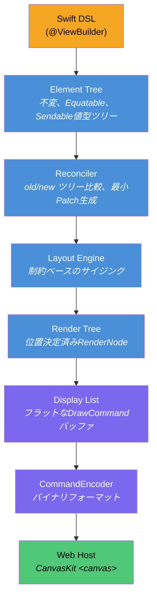
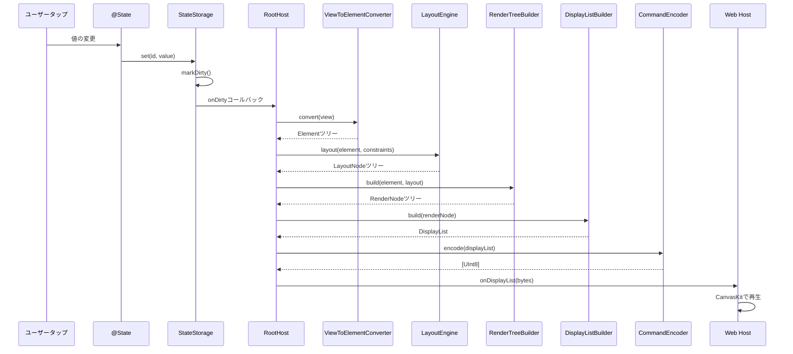
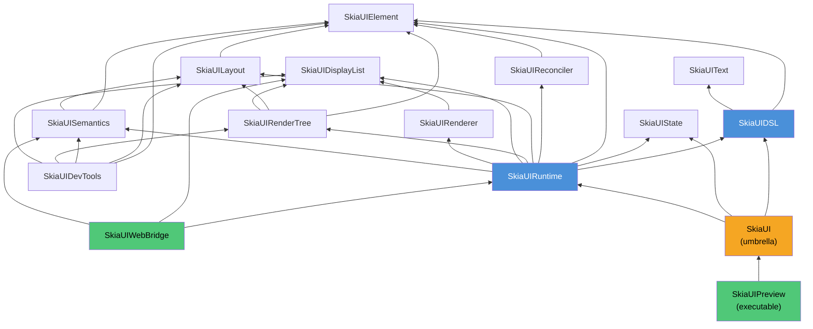

# SkiaUI

Swiftで書く宣言型UIエンジン。Webでは[Skia (CanvasKit)](https://skia.org/docs/user/modules/canvaskit/)でレンダリングします。SwiftUIスタイルのコードを書き、HTML Canvas上にピクセル単位で正確なUIを描画します。

**[English](../README.md)** | **[한국어](README_ko.md)** | **[中文](README_zh.md)**

```swift
struct CounterView: View {
    @State private var count = 0

    var body: some View {
        VStack(spacing: 16) {
            Text("Count: \(count)")
                .font(size: 32)
                .foregroundColor(.blue)

            HStack(spacing: 16) {
                Text("- Decrease")
                    .padding(12)
                    .background(.red)
                    .foregroundColor(.white)
                    .onTapGesture { count -= 1 }

                Text("+ Increase")
                    .padding(12)
                    .background(.blue)
                    .foregroundColor(.white)
                    .onTapGesture { count += 1 }
            }
        }
        .padding(32)
    }
}
```

## なぜSkiaUIなのか

Swift開発者がWeb UIを構築するには、JavaScriptベースのスタックに移行するか、DOM中心のレンダリングの制約を受け入れるしかありません。

SkiaUIは異なるアプローチを取ります：

- **Swiftを単一のUI言語に** -- 宣言型ResultBuilder DSL、`@State`、modifier
- **Canvasベースレンダリング** -- DOM要素ではなく、Skia描画コマンドで`<canvas>`に直接描画
- **レンダラー非依存コア** -- DSLとレイアウトエンジンはCanvasKitを一切知らない。ネイティブSkiaやMetalバックエンドをユーザーコード変更なしで追加可能

## アーキテクチャ

核心的な設計原則は**宣言、計算、描画の厳格な分離**です。DSLはレンダラーと会話しません。レンダラーはビューコードをパースしません。バイナリディスプレイリストがその境界に位置します。



各レイヤーは独立したSwiftモジュールであり、`Package.swift`に明示的な依存境界が定義されています。どのレイヤーも単独で交換・テスト可能です。

### 状態変更時のデータフロー



### モジュール依存グラフ



## モジュールマップ

```text
SkiaUI (umbrella)
  @_exported import SkiaUIDSL
  @_exported import SkiaUIState
  @_exported import SkiaUIRuntime

SkiaUIDSL           -> [SkiaUIElement, SkiaUIText]
  Viewプロトコル、@ViewBuilder、PrimitiveViewプロトコル
  Primitives:   Text, Rectangle, Spacer, EmptyView
  Containers:   VStack, HStack, ZStack
  Modifiers:    padding, frame, background, foregroundColor, font,
                onTapGesture, accessibilityLabel/Role/Hint/Hidden
  Types:        Color, Alignment, EdgeInsets, Rect
  AnyView, ConditionalView, TupleView2, ViewToElementConverter

SkiaUIElement       -> (依存なし)
  Element (indirect enum), ElementID, ElementTree

SkiaUIText          -> (依存なし)
  FontDescriptor, FontWeight, TextStyle, ParagraphSpec

SkiaUIState         -> (依存なし)
  @State, Binding, StateStorage, Environment, Scheduler

SkiaUIReconciler    -> [SkiaUIElement]
  Reconciler, Patch, ElementPath, DirtyTracker

SkiaUILayout        -> [SkiaUIElement]
  LayoutEngine, LayoutNode, Constraints
  LayoutStrategyプロトコル, VStackLayout, HStackLayout, ZStackLayout

SkiaUIRenderTree    -> [SkiaUIElement, SkiaUILayout, SkiaUIDisplayList]
  RenderNode, RenderTreeBuilder, DisplayListBuilder
  PaintStyle, TextContent, Transform, Clip

SkiaUIDisplayList   -> (依存なし)
  DisplayList, DrawCommand, CommandEncoder, RetainedSubtree

SkiaUIRenderer      -> [SkiaUIDisplayList]
  RendererBackendプロトコル, RendererConfig, TextMetrics

SkiaUISemantics     -> [SkiaUIElement, SkiaUILayout]
  SemanticsNode, SemanticsTreeBuilder, SemanticsRole
  SemanticsAction, SemanticsUpdate

SkiaUIRuntime       -> [SkiaUIDSL, SkiaUIState, SkiaUIElement,
                        SkiaUIReconciler, SkiaUILayout, SkiaUIRenderTree,
                        SkiaUIDisplayList, SkiaUIRenderer, SkiaUISemantics]
  Appプロトコル, RootHost, FrameLoop

SkiaUIWebBridge     -> [SkiaUIRuntime, SkiaUIDisplayList, SkiaUISemantics]
  WebBridge, JSHostBinding, DisplayListExport, SemanticsExport
  (JavaScriptKit依存 -- ここにのみ隔離、Wasm専用)

SkiaUIDevTools      -> [SkiaUIElement, SkiaUILayout, SkiaUISemantics,
                        SkiaUIRenderTree, SkiaUIDisplayList]
  TreeInspector, DebugOverlay, SemanticsInspector

SkiaUIPreview       -> [SkiaUI]  (実行可能ターゲット)
  ディスプレイリストをWebHostに提供するHTTPサーバー
```

コアモジュールに外部依存はありません。`JavaScriptKit`はWebAssemblyビルド時に`SkiaUIWebBridge`でのみ使用されます。

## 核心設計決定

### Element: indirect enumとして設計

```swift
public indirect enum Element: Equatable, Sendable {
    case empty
    case text(String, TextProperties)
    case rectangle(RectangleProperties)
    case spacer(minLength: Float?)
    case container(ContainerProperties, children: [Element])
    case modified(Element, Modifier)
}
```

UIツリー全体が単一の値型`Equatable`構造体です。diffが簡単で、シリアライズが直感的で、スナップショットテストが自然です。参照型なし、Element レベルのidentity管理なし。

`Element.Modifier`はすべてのmodifierをフラットなenum caseとしてエンコードします：

```swift
public enum Modifier: Equatable, Sendable {
    case padding(top: Float, leading: Float, bottom: Float, trailing: Float)
    case frame(width: Float?, height: Float?, alignment: Int)
    case background(ElementColor)
    case foregroundColor(ElementColor)
    case font(size: Float, weight: Int)
    case onTap(id: Int)
    case accessibilityLabel(String)
    case accessibilityRole(String)
    case accessibilityHint(String)
    case accessibilityHidden(Bool)
}
```

### 制約ベースレイアウト

```swift
public struct Constraints: Equatable, Sendable {
    var minWidth, maxWidth, minHeight, maxHeight: Float

    func constrain(width: Float, height: Float) -> (width: Float, height: Float)
    func inset(top:leading:bottom:trailing:) -> Constraints
    func withExactWidth(_ width: Float) -> Constraints
    func withExactHeight(_ height: Float) -> Constraints
}

public protocol LayoutStrategy: Sendable {
    func layout(children: [Element], constraints: Constraints,
                measure: (Element, Constraints) -> LayoutNode) -> LayoutNode
}
```

各スタックタイプ（`VStackLayout`、`HStackLayout`、`ZStackLayout`）が`LayoutStrategy`を実装します。エンジンは制約を下方に伝播し、子がサイズを上方に報告します。Spacerは残りのスペースを吸収します。レイアウトに影響するmodifier（`padding`、`frame`）は内部レイアウトを子としてラップし、透過modifier（`background`、`foregroundColor`、`onTap`、`font`、アクセシビリティ）はレイアウトをそのまま通過させます。

### ディスプレイリスト：レンダリング境界

```swift
public enum DrawCommand: Equatable, Sendable {
    case save
    case restore
    case translate(x: Float, y: Float)
    case clipRect(x: Float, y: Float, width: Float, height: Float)
    case drawRect(x: Float, y: Float, width: Float, height: Float, color: UInt32)
    case drawRRect(x: Float, y: Float, width: Float, height: Float, radius: Float, color: UInt32)
    case drawText(text: String, x: Float, y: Float, fontSize: Float,
                  fontWeight: Int, color: UInt32, boundsWidth: Float)
    case retainedSubtreeBegin(id: Int, version: Int)
    case retainedSubtreeEnd
}
```

ディスプレイリストは**Swift-JavaScript境界を越える唯一のデータ**です。`CommandEncoder`がコンパクトなバイナリフォーマットにシリアライズします：

| フィールド | フォーマット | サイズ |
| ---------- | ------------ | ------ |
| ヘッダーバージョン | `Int32` | 4バイト |
| ヘッダーコマンド数 | `Int32` | 4バイト |
| コマンドopcode | `UInt8` | 1バイト |
| コマンドパラメータ | `Float32` / `Int32` / `UInt32` / 長さ接頭辞UTF-8 | 可変 |

opcodeは1-9、全値リトルエンディアン。TypeScript `DisplayListPlayer`がこのフォーマットを`ArrayBuffer`から直接読み取り、CanvasKit APIコールとして再生します -- オブジェクトマーシャリングなし、JSONパースなし。

### レンダーツリー

```swift
public final class RenderNode: @unchecked Sendable {
    var frame: (x: Float, y: Float, width: Float, height: Float)
    var paintStyle: PaintStyle?        // fillColor: UInt32?, cornerRadius: Float
    var textContent: TextContent?      // text, fontSize, fontWeight, color (ARGB UInt32)
    var children: [RenderNode]
    var clipToBounds: Bool
}
```

`RenderTreeBuilder`が`Element`ツリーと`LayoutNode`ツリーを同時に走査し、位置決定済みの`RenderNode`を生成します。`DisplayListBuilder`がレンダーツリーからsave/translate/draw/restoreパターンで描画コマンドを出力します。

### Reconciler

```swift
public enum Patch: Equatable, Sendable {
    case insert(path: ElementPath, element: Element)
    case delete(path: ElementPath)
    case update(path: ElementPath, from: Element, to: Element)
    case replace(path: ElementPath, from: Element, to: Element)
}
```

`ElementPath`はツリー位置を`[Int]`インデックスでエンコードします。`DirtyTracker`はパスとその祖先をマーキングしてターゲットre-layoutを実行します。

### リアクティブ状態

```swift
@propertyWrapper
public struct State<Value: Sendable>: Sendable where Value: Equatable {
    public var wrappedValue: Value { get nonmutating set }
    public var projectedValue: Binding<Value> { get }
}
```

`@State`はグローバル`StateStorage`（`NSLock`ベースのスレッドセーフ）に支えられています。変更時に前の値と比較し、実際の変更のみ`markDirty()`をトリガーし、`onDirty`コールバックで再レンダリングを実行します。`RootHost`がこのコールバックを接続して完全なレンダーパスを実行します。

### ViewBuilder (SE-0348)

```swift
@resultBuilder
public struct ViewBuilder {
    static func buildBlock() -> EmptyView
    static func buildPartialBlock<V: View>(first: V) -> V
    static func buildPartialBlock<A: View, V: View>(accumulated: A, next: V) -> TupleView2<A, V>
    static func buildOptional<V: View>(_ component: V?) -> ConditionalView<V, EmptyView>
    static func buildEither<T: View, F: View>(first: T) -> ConditionalView<T, F>
    static func buildEither<T: View, F: View>(second: F) -> ConditionalView<T, F>
}
```

`buildPartialBlock`（SE-0348）を使用して無制限の子をサポートします。`TupleView2`がネストされたペアを`TupleViewProtocol`を通じてフラットな子配列に展開します。`ConditionalView`がネストされた`buildEither`呼び出しで`if`/`else if`/`else`チェーンを処理します。

## DSLインターフェース

### Primitives

| ビュー | 説明 |
| ------ | ---- |
| `Text("Hello")` | スタイル付きテキストノード |
| `Rectangle()` | 単色または角丸の矩形 |
| `Spacer()` | スタック内のフレキシブルスペース |
| `EmptyView()` | サイズゼロのプレースホルダー |

### Containers

| ビュー | 説明 |
| ------ | ---- |
| `VStack(alignment:spacing:)` | 垂直レイアウト（整列: `.leading`, `.center`, `.trailing`） |
| `HStack(alignment:spacing:)` | 水平レイアウト（整列: `.top`, `.center`, `.bottom`） |
| `ZStack(alignment:)` | オーバーレイ/レイヤーレイアウト（9ポイント整列） |

### View modifier

| Modifier | 例 |
| -------- | -- |
| `.padding(_:)` | `.padding(16)` または `.padding(top: 8, leading: 16, bottom: 8, trailing: 16)` |
| `.frame(width:height:)` | `.frame(width: 200, height: 100)` |
| `.background(_:)` | `.background(.blue)` |
| `.foregroundColor(_:)` | `.foregroundColor(.white)` |
| `.font(size:weight:)` | `.font(size: 24, weight: .bold)` |
| `.onTapGesture { }` | `.onTapGesture { count += 1 }` |
| `.accessibilityLabel(_:)` | `.accessibilityLabel("閉じるボタン")` |
| `.accessibilityRole(_:)` | `.accessibilityRole("button")` |
| `.accessibilityHint(_:)` | `.accessibilityHint("ダブルタップで閉じる")` |
| `.accessibilityHidden(_:)` | `.accessibilityHidden(true)` |

### Rectangle専用modifier

| Modifier | 例 |
| -------- | -- |
| `.fill(_:)` | `Rectangle().fill(.red)` |
| `.cornerRadius(_:)` | `Rectangle().fill(.orange).cornerRadius(12)` |

### 型

| 型 | 値 |
| -- | -- |
| `Color` | `.red`, `.blue`, `.green`, `.orange`, `.purple`, `.yellow`, `.gray`, `.black`, `.white`, `.clear` |
| `Color(red:green:blue:)` | `Color(red: 0.2, green: 0.6, blue: 0.9)` |
| `Color(white:)` | `Color(white: 0.75)` |
| `FontWeight` | `.ultraLight`, `.thin`, `.light`, `.regular`, `.medium`, `.semibold`, `.bold`, `.heavy`, `.black` |
| `HorizontalAlignment` | `.leading`, `.center`, `.trailing` |
| `VerticalAlignment` | `.top`, `.center`, `.bottom` |

## Web Host

TypeScriptウェブホスト（`WebHost/`）は意図的に薄く設計されています。役割は以下の4つのみです：

1. **ブートストラップ** -- CanvasKit WASMロード、WebGLベースの`<canvas>`作成、フォントローディング
2. **再生** -- バイナリディスプレイリストを読み取りCanvasKit描画メソッドを呼び出し
3. **イベント転送** -- ポインター/クリック座標をSwiftに転送してヒットテスト
4. **ビューポート同期** -- ブラウザリサイズ時にSwiftに通知

ホストはUIツリー、レイアウト、状態について一切知りません。ディスプレイリストプレイヤーです。

```text
WebHost/
  package.json              canvaskit-wasm, vite, typescript
  vite.config.ts
  index.html
  src/
    main.ts                 エントリーポイント
    bootstrap.ts            CanvasKit初期化シーケンス
    canvaskitHost.ts        Surface作成、フレームループ、ビューポート同期
    canvaskitBackend.ts     Canvas APIラッパー
    displayListPlayer.ts    バイナリバッファ -> CanvasKit API呼び出し
    eventBridge.ts          ポインター/クリックイベント委譲
    debugOverlay.ts         FPSとデバッグ可視化
    semanticsOverlay.ts     アクセシビリティツリーオーバーレイ
```

## 始め方

### 前提条件

- Swift 6.2+
- macOS 14.0+
- Node.js / pnpm（ウェブホスト用）

### ビルドと実行

```bash
# 全モジュールビルド
swift build

# テスト実行（7スイート、49テスト）
swift test

# プレビューサーバー起動（HTTP :3001でディスプレイリスト配信）
swift run SkiaUIPreview

# 別ターミナルでウェブホスト開発サーバー起動
cd WebHost && pnpm install && pnpm dev
```

ブラウザで`http://localhost:5173`を開きます。ダッシュボードに5つのサンプルビュー（Counter、Typography、Shapes & Colors、Layout、Accessibility）が表示され、DSLインターフェース全体をデモします。

## プロジェクト状態

SkiaUIは初期開発段階です。現在の実装範囲：

- [x] `@ViewBuilder`ベースのResultBuilder DSL（SE-0348 `buildPartialBlock`）
- [x] 4つのprimitiveビュー（`Text`、`Rectangle`、`Spacer`、`EmptyView`）
- [x] 3つのcontainerビュー（`VStack`、`HStack`、`ZStack`）
- [x] 10個のview modifier + 2個のRectangle専用modifier
- [x] `@State`リアクティビティと自動再レンダリング
- [x] プラガブル`LayoutStrategy`ベースの制約レイアウトエンジン
- [x] 最小diff基盤のツリー再調整（`Patch`、`DirtyTracker`）
- [x] バイナリディスプレイリストエンコーディング/デコーディング（`CommandEncoder`）
- [x] TypeScriptホストを通じたCanvasKitウェブレンダリング
- [x] Z-order正確なヒットテスト基盤のタップ/クリックイベント処理
- [x] アクセシビリティセマンティクスツリー（`SemanticsNode`、`SemanticsTreeBuilder`）
- [x] 7スイート、49テスト

### ロードマップ

- [ ] ScrollView / List
- [ ] アニメーションシステム
- [ ] 画像サポート
- [ ] キーボード / フォーカス管理
- [ ] アクセシビリティDOMオーバーレイ
- [ ] ネイティブSkiaバックエンド（Metal / Vulkan）
- [ ] Hot reload

## ライセンス

MIT
