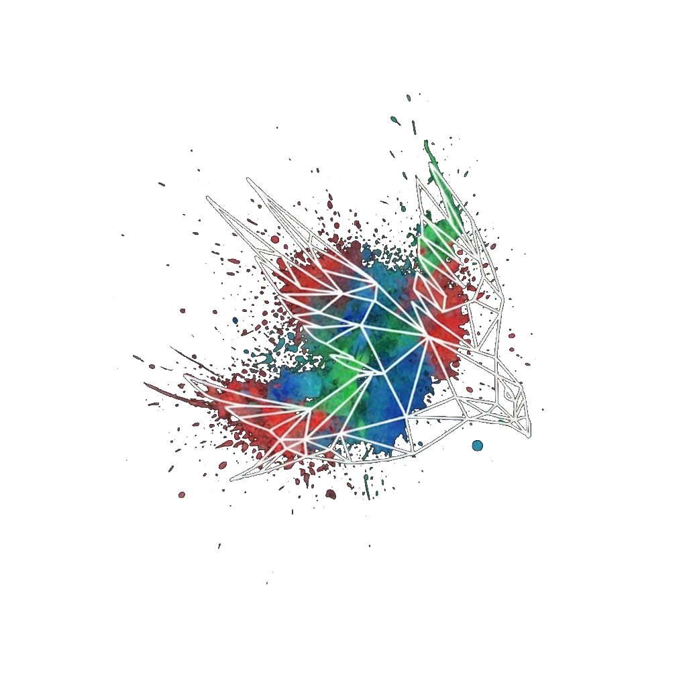
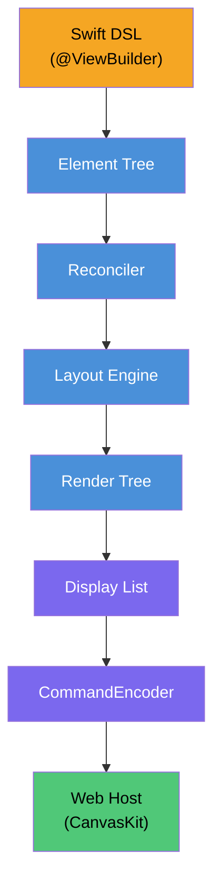

<p align="center">
  
</p>

# SkiaUI

Swift로 작성하는 선언형 UI 엔진. 웹에서 [Skia (CanvasKit)](https://skia.org/docs/user/modules/canvaskit/)로 렌더링합니다.

SwiftUI 스타일 코드를 작성하고, HTML `<canvas>` 위에 픽셀 단위로 정확한 UI를 그립니다.

**[English](../README.md)** | **[日本語](README_ja.md)** | **[中文](README_zh.md)** | **[Documentation](https://devyhan.github.io/SkiaUI/)**

> [!IMPORTANT]
> SkiaUI는 현재 **실험적 단계**입니다. API가 불안정하며 예고 없이 변경될 수 있습니다. 프로덕션 사용은 권장하지 않습니다.

```swift
import SkiaUI

struct CounterView: View {
    @State private var count = 0

    var body: some View {
        VStack(spacing: 16) {
            Text("Count: \(count)")
                .font(size: 32)
                .foregroundColor(.blue)

            HStack(spacing: 16) {
                Text("- Decrease")
                    .padding(12)
                    .background(.red)
                    .foregroundColor(.white)
                    .onTapGesture { count -= 1 }

                Text("+ Increase")
                    .padding(12)
                    .background(.blue)
                    .foregroundColor(.white)
                    .onTapGesture { count += 1 }
            }
        }
        .padding(32)
    }
}
```

## 목표

- **Swift를 단일 UI 언어로** -- 선언형 ResultBuilder DSL, `@State`, modifier
- **Canvas 기반 렌더링** -- DOM 요소가 아닌 Skia 드로잉 명령으로 `<canvas>`에 직접 렌더링
- **렌더러 비의존 코어** -- 네이티브 Skia나 Metal 백엔드를 사용자 코드 변경 없이 추가 가능

## 아키텍처



각 레이어는 독립된 Swift 모듈입니다. 바이너리 디스플레이 리스트가 **Swift–JavaScript 경계를 넘는 유일한 데이터**이며, JSON 파싱이나 객체 마샬링이 없습니다.

## 기능 현황

| 카테고리 | 기능 | 상태 |
| -------- | ---- | ---- |
| **뷰** | Text, Rectangle, Spacer, EmptyView | 완료 |
| **컨테이너** | VStack, HStack, ZStack, ScrollView | 완료 |
| **Modifier** | padding, frame, background, foregroundColor, font, fontFamily, onTapGesture, drawingGroup | 완료 |
| **타이포그래피** | Font 구조체 (.custom, .system, 시맨틱 스타일), fontFamily 파이프라인, FontManager | 완료 |
| **레이아웃** | ProposedSize 협상, layoutPriority, fixedSize, 유연 프레임 (min/ideal/max) | 완료 |
| **상태** | @State, Binding, 자동 재렌더링, 증분 평가 (AttributeGraph) | 완료 |
| **접근성** | accessibilityLabel, accessibilityRole, accessibilityHint, accessibilityHidden | 완료 |
| **렌더링** | 바이너리 디스플레이 리스트, CanvasKit 재생, 리테인드 서브트리, 파이프라인 최적화 | 완료 |
| **Reconciler** | 트리 diff, Patch, DirtyTracker, RootHost 연동 | 완료 |
| **테스트** | 21개 스위트, 161개 테스트 | 완료 |
| **렌더링** | List | 예정 |
| **렌더링** | 애니메이션 시스템 | 예정 |
| **렌더링** | 이미지 지원 | 예정 |
| **플랫폼** | 네이티브 Skia 백엔드 (Metal / Vulkan) | 예정 |

## 제품

| 제품 | 설명 |
| ---- | ---- |
| **SkiaUI** | 엄브렐라 모듈 — `import SkiaUI`로 DSL, 상태, 런타임 API 전체 접근 |
| **SkiaUIWebBridge** | WebAssembly 빌드용 JavaScriptKit 인터롭 레이어 (의존성 격리) |
| **SkiaUIDevTools** | TreeInspector, DebugOverlay, SemanticsInspector 개발 도구 |

## 시작하기

### 요구사항

- Swift 6.2+
- macOS 14.0+
- Node.js / pnpm (WebClient용)

### 빌드 및 테스트

```bash
# 전체 모듈 빌드
swift build

# 테스트 실행
swift test
```

### 빠른 시작 (WASM)

WebAssembly로 SkiaUI 앱을 브라우저에 직접 배포하는 5단계:

**1. Swift WASM SDK 설치**

```bash
swift sdk install https://download.swift.org/swift-6.2.4-release/wasm-sdk/swift-6.2.4-RELEASE/swift-6.2.4-RELEASE_wasm.artifactbundle.tar.gz
```

**2. 예제 프로젝트 복사**

```bash
cp -r Examples/BasicApp ~/MySkiaUIApp
cd ~/MySkiaUIApp
```

**3. `Sources/App.swift` 수정**

```swift
import SkiaUI
import SkiaUIWebBridge

@main
struct BasicApp: SkiaUI.App {
    var body: some View {
        VStack(spacing: 16) {
            Text("Hello, SkiaUI!")
                .fontSize(28)
                .bold()
        }
    }

    static func main() {
        WebBridge.start(BasicApp.self)
    }
}
```

**4. 빌드**

```bash
./build.sh
```

**5. 서버 실행 후 열기**

```bash
npx serve dist    # 또는: python3 -m http.server -d dist
```

브라우저에서 `http://localhost:3000`을 엽니다.

> 전체 예제 프로젝트는 [`Examples/BasicApp/`](../Examples/BasicApp/)을 참조하세요.

## 서버 통합

SkiaUI는 서버(예: Vapor)에서 실행하고 바이너리 디스플레이 리스트를 HTTP로 브라우저 클라이언트에 전송할 수 있습니다.

**1. 의존성 추가**

```swift
// Package.swift
dependencies: [
    .package(url: "https://github.com/devyhan/SkiaUI.git", branch: "main")
],
targets: [
    .executableTarget(name: "MyApp", dependencies: [
        .product(name: "SkiaUI", package: "SkiaUI")
    ])
]
```

**2. View 렌더링**

```swift
import SkiaUI

let host = RootHost()
host.setViewport(width: 800, height: 600)

var bytes: [UInt8] = []
host.setOnDisplayList { bytes = $0 }
host.render(CounterView())
// `bytes`에 바이너리 디스플레이 리스트가 저장됨
```

**3. HTTP로 제공**

```swift
// Vapor 예시
app.get("display-list") { req -> Response in
    var bytes: [UInt8] = []
    host.setOnDisplayList { bytes = $0 }
    host.render(MyView())
    return Response(
        status: .ok,
        headers: ["Content-Type": "application/octet-stream"],
        body: .init(data: Data(bytes))
    )
}
```

**4. 브라우저 클라이언트**

`WebClient/` 정적 파일을 서버의 public 디렉토리에 복사한 후 fetch하여 재생합니다:

```js
const resp = await fetch('/display-list');
const buffer = await resp.arrayBuffer();
player.play(buffer, canvas);
```

## 알려진 제약사항

- 텍스트 렌더링은 실제 폰트 메트릭이 아닌 추정 글리프 폭(`fontSize × 0.6 × 글자수`)에 의존
- 텍스트 줄바꿈 미지원 — 단일 행 텍스트만 가능
- `onTapGesture` 외 제스처 인식기 미지원
- 키보드 입력 및 포커스 관리 미지원
- 이미지 로딩 및 렌더링 미지원
- 애니메이션 및 트랜지션 미지원

## 라이선스

MIT — 자세한 내용은 [LICENSE](../LICENSE)를 참조하세요.

서드파티 라이선스는 [THIRD_PARTY_NOTICES](../THIRD_PARTY_NOTICES)에 명시되어 있습니다.

## 면책 조항

SwiftUI는 Apple Inc.의 상표입니다. 이 프로젝트는 Apple Inc.와 제휴, 보증, 또는 어떠한 관련도 없습니다.
