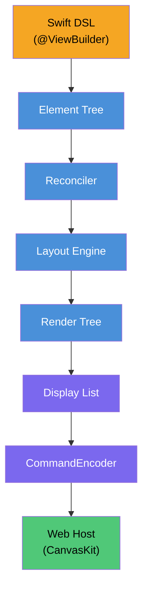

<p align="center">
  
</p>

# SkiaUI

用Swift编写的声明式UI引擎。在Web上通过[Skia (CanvasKit)](https://skia.org/docs/user/modules/canvaskit/)进行渲染。

编写SwiftUI风格的代码，在HTML `<canvas>` 上绘制像素级精确的UI。

**[English](../README.md)** | **[한국어](README_ko.md)** | **[日本語](README_ja.md)** | **[Documentation](https://devyhan.github.io/SkiaUI/)**

> [!IMPORTANT]
> SkiaUI目前处于**实验阶段**。API不稳定，可能会在没有通知的情况下更改。不建议在生产环境中使用。

```swift
import SkiaUI

struct CounterView: View {
    @State private var count = 0

    var body: some View {
        VStack(spacing: 16) {
            Text("Count: \(count)")
                .font(size: 32)
                .foregroundColor(.blue)

            HStack(spacing: 16) {
                Text("- Decrease")
                    .padding(12)
                    .background(.red)
                    .foregroundColor(.white)
                    .onTapGesture { count -= 1 }

                Text("+ Increase")
                    .padding(12)
                    .background(.blue)
                    .foregroundColor(.white)
                    .onTapGesture { count += 1 }
            }
        }
        .padding(32)
    }
}
```

## 目标

- **Swift作为唯一的UI语言** -- 声明式ResultBuilder DSL、`@State`、modifier
- **基于Canvas的渲染** -- 不是DOM元素，而是通过Skia绘图命令直接在`<canvas>`上渲染
- **渲染器无关的核心** -- 无需修改用户代码即可添加原生Skia或Metal后端

## 架构



每一层都是独立的Swift模块。二进制显示列表是**跨越Swift–JavaScript边界的唯一数据**，零JSON解析、零对象编组。

## 功能状态

| 类别 | 功能 | 状态 |
| ---- | ---- | ---- |
| **视图** | Text, Rectangle, Spacer, EmptyView | 完成 |
| **容器** | VStack, HStack, ZStack, ScrollView | 完成 |
| **Modifier** | padding, frame, background, foregroundColor, font, fontFamily, onTapGesture, drawingGroup | 完成 |
| **排版** | Font结构体 (.custom, .system, 语义样式)、fontFamily管线、FontManager | 完成 |
| **布局** | ProposedSize协商、layoutPriority、fixedSize、弹性框架 (min/ideal/max) | 完成 |
| **状态** | @State, Binding, 自动重新渲染, 增量评估 (AttributeGraph) | 完成 |
| **无障碍** | accessibilityLabel, accessibilityRole, accessibilityHint, accessibilityHidden | 完成 |
| **渲染** | 二进制显示列表、CanvasKit回放、保留子树、管线优化 | 完成 |
| **Reconciler** | 树diff、Patch、DirtyTracker、RootHost集成 | 完成 |
| **测试** | 21个套件、161个测试 | 完成 |
| **渲染** | List | 计划中 |
| **渲染** | 动画系统 | 计划中 |
| **渲染** | 图片支持 | 计划中 |
| **平台** | 原生Skia后端 (Metal / Vulkan) | 计划中 |

## 产品

| 产品 | 描述 |
| ---- | ---- |
| **SkiaUI** | 伞模块 — `import SkiaUI` 访问所有DSL、状态和运行时API |
| **SkiaUIWebBridge** | WebAssembly构建用JavaScriptKit互操作层（依赖隔离） |
| **SkiaUIDevTools** | TreeInspector、DebugOverlay、SemanticsInspector开发工具 |

## 快速开始

### 要求

- Swift 6.2+
- macOS 14.0+
- Node.js / pnpm（用于WebClient）

### 构建与测试

```bash
# 构建所有模块
swift build

# 运行测试
swift test
```

### 快速开始 (WASM)

通过 WebAssembly 将 SkiaUI 应用直接部署到浏览器的 4 个步骤:

**1. 复制示例项目**

```bash
cp -r Examples/BasicApp ~/MySkiaUIApp
cd ~/MySkiaUIApp
```

**2. 构建**

```bash
# 构建项目 (默认为 dist/ 目录)
swift run skia build --product App
```

**3. 启动服务器**

如需运行 Web 服务器，请参阅下方的 [服务器集成](#服务器集成) 部分中的 Vapor 示例。

> 完整示例项目请参阅 [`Examples/BasicApp/`](../Examples/BasicApp/)。

## 服务器集成

SkiaUI 可以通过两种主要方式集成到 Swift 服务器环境中：

### 1. 提供 WASM 应用服务 (使用 Vapor)
最常见的方法是使用 [Vapor](https://vapor.codes) 将构建的 WASM 应用作为静态文件提供服务。

*   **构建**: `swift run skia build -o Public`
*   **运行**: `swift run App`
*   **示例**: 详细配置请参阅 [`Examples/Server/Vapor/`](../Examples/Server/Vapor/)。

### 2. 服务器端渲染 (SSR)
您还可以直接在服务器上运行 SkiaUI，动态生成二进制显示列表。生成的列表可以发送到任何客户端（iOS、Android 或 Web），实现像素级精确的回放。

*   **机制**: 使用 `RootHost` 将视图渲染为 `[UInt8]` 二进制缓冲区。
*   **示例**: 有关框架无关的实现，请参阅 [`Examples/Server/Generic/`](../Examples/Server/Generic/)。

```swift
import SkiaUI

let host = RootHost()
host.render(MyView())
host.setOnDisplayList { bytes in
    // 将二进制 'bytes' 发送到客户端
}
```

## 已知限制

- 文本渲染依赖估算字形宽度（`fontSize × 0.6 × 字符数`），而非真实字体度量
- 不支持文本换行 — 仅支持单行文本
- 除 `onTapGesture` 外不支持其他手势识别
- 不支持键盘输入和焦点管理
- 不支持图片加载和渲染
- 不支持动画和过渡

## 许可证

MIT — 详细信息请参阅 [LICENSE](../LICENSE)。

第三方许可证列于 [THIRD_PARTY_NOTICES](../THIRD_PARTY_NOTICES)。

## 免责声明

SwiftUI是Apple Inc.的商标。本项目与Apple Inc.没有任何关联、认可或关系。
