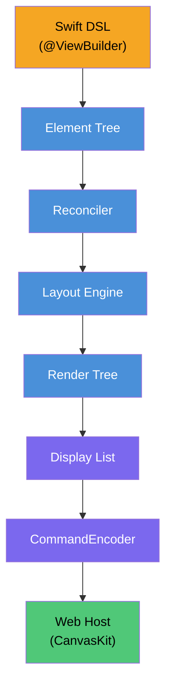

<p align="center">
  
</p>

# SkiaUI

用Swift编写的声明式UI引擎。在Web上通过[Skia (CanvasKit)](https://skia.org/docs/user/modules/canvaskit/)进行渲染。

编写SwiftUI风格的代码，在HTML `<canvas>` 上绘制像素级精确的UI。

**[English](../README.md)** | **[한국어](README_ko.md)** | **[日本語](README_ja.md)** | **[Documentation](https://devyhan.github.io/SkiaUI/)**

> [!IMPORTANT]
> SkiaUI目前处于**实验阶段**。API不稳定，可能会在没有通知的情况下更改。不建议在生产环境中使用。

```swift
import SkiaUI

struct CounterView: View {
    @State private var count = 0

    var body: some View {
        VStack(spacing: 16) {
            Text("Count: \(count)")
                .font(size: 32)
                .foregroundColor(.blue)

            HStack(spacing: 16) {
                Text("- Decrease")
                    .padding(12)
                    .background(.red)
                    .foregroundColor(.white)
                    .onTapGesture { count -= 1 }

                Text("+ Increase")
                    .padding(12)
                    .background(.blue)
                    .foregroundColor(.white)
                    .onTapGesture { count += 1 }
            }
        }
        .padding(32)
    }
}
```

## 目标

- **Swift作为唯一的UI语言** -- 声明式ResultBuilder DSL、`@State`、modifier
- **基于Canvas的渲染** -- 不是DOM元素，而是通过Skia绘图命令直接在`<canvas>`上渲染
- **渲染器无关的核心** -- 无需修改用户代码即可添加原生Skia或Metal后端

## 架构



每一层都是独立的Swift模块。二进制显示列表是**跨越Swift–JavaScript边界的唯一数据**，零JSON解析、零对象编组。

## 功能状态

| 类别 | 功能 | 状态 |
| ---- | ---- | ---- |
| **视图** | Text, Rectangle, Spacer, EmptyView | 完成 |
| **容器** | VStack, HStack, ZStack, ScrollView | 完成 |
| **Modifier** | padding, frame, background, foregroundColor, font, fontFamily, onTapGesture, drawingGroup | 完成 |
| **排版** | Font结构体 (.custom, .system, 语义样式)、fontFamily管线、FontManager | 完成 |
| **布局** | ProposedSize协商、layoutPriority、fixedSize、弹性框架 (min/ideal/max) | 完成 |
| **状态** | @State, Binding, 自动重新渲染, 增量评估 (AttributeGraph) | 完成 |
| **无障碍** | accessibilityLabel, accessibilityRole, accessibilityHint, accessibilityHidden | 完成 |
| **渲染** | 二进制显示列表、CanvasKit回放、保留子树、管线优化 | 完成 |
| **Reconciler** | 树diff、Patch、DirtyTracker、RootHost集成 | 完成 |
| **测试** | 21个套件、161个测试 | 完成 |
| **渲染** | List | 计划中 |
| **渲染** | 动画系统 | 计划中 |
| **渲染** | 图片支持 | 计划中 |
| **平台** | 原生Skia后端 (Metal / Vulkan) | 计划中 |

## 产品

| 产品 | 描述 |
| ---- | ---- |
| **SkiaUI** | 伞模块 — `import SkiaUI` 访问所有DSL、状态和运行时API |
| **SkiaUIWebBridge** | WebAssembly构建用JavaScriptKit互操作层（依赖隔离） |
| **SkiaUIDevTools** | TreeInspector、DebugOverlay、SemanticsInspector开发工具 |

## 快速开始

### 要求

- Swift 6.2+
- macOS 14.0+
- Node.js / pnpm（用于WebClient）

### 构建与测试

```bash
# 构建所有模块
swift build

# 运行测试
swift test
```

### 快速开始 (WASM)

通过WebAssembly将SkiaUI应用直接部署到浏览器的5个步骤:

**1. 安装Swift WASM SDK**

```bash
swift sdk install https://download.swift.org/swift-6.2.4-release/wasm-sdk/swift-6.2.4-RELEASE/swift-6.2.4-RELEASE_wasm.artifactbundle.tar.gz
```

**2. 复制示例项目**

```bash
cp -r Examples/BasicApp ~/MySkiaUIApp
cd ~/MySkiaUIApp
```

**3. 编辑 `Sources/App.swift`**

```swift
import SkiaUI
import SkiaUIWebBridge

@main
struct BasicApp: SkiaUI.App {
    var body: some View {
        VStack(spacing: 16) {
            Text("Hello, SkiaUI!")
                .fontSize(28)
                .bold()
        }
    }

    static func main() {
        WebBridge.start(BasicApp.self)
    }
}
```

**4. 构建**

```bash
./build.sh
```

**5. 启动服务器并打开**

```bash
npx serve dist    # 或: python3 -m http.server -d dist
```

在浏览器中打开 `http://localhost:3000`。

> 完整示例项目请参阅 [`Examples/BasicApp/`](../Examples/BasicApp/)。

## 服务器集成

SkiaUI可以在服务器（如Vapor）上运行，并通过HTTP将二进制显示列表流式传输到浏览器客户端。

**1. 添加依赖**

```swift
// Package.swift
dependencies: [
    .package(url: "https://github.com/devyhan/SkiaUI.git", branch: "main")
],
targets: [
    .executableTarget(name: "MyApp", dependencies: [
        .product(name: "SkiaUI", package: "SkiaUI")
    ])
]
```

**2. 渲染View**

```swift
import SkiaUI

let host = RootHost()
host.setViewport(width: 800, height: 600)

var bytes: [UInt8] = []
host.setOnDisplayList { bytes = $0 }
host.render(CounterView())
// `bytes` 现在包含二进制显示列表
```

**3. 通过HTTP提供**

```swift
// Vapor示例
app.get("display-list") { req -> Response in
    var bytes: [UInt8] = []
    host.setOnDisplayList { bytes = $0 }
    host.render(MyView())
    return Response(
        status: .ok,
        headers: ["Content-Type": "application/octet-stream"],
        body: .init(data: Data(bytes))
    )
}
```

**4. 浏览器客户端**

将`WebClient/`静态文件复制到服务器的public目录，然后fetch并回放：

```js
const resp = await fetch('/display-list');
const buffer = await resp.arrayBuffer();
player.play(buffer, canvas);
```

## 已知限制

- 文本渲染依赖估算字形宽度（`fontSize × 0.6 × 字符数`），而非真实字体度量
- 不支持文本换行 — 仅支持单行文本
- 除 `onTapGesture` 外不支持其他手势识别
- 不支持键盘输入和焦点管理
- 不支持图片加载和渲染
- 不支持动画和过渡

## 许可证

MIT — 详细信息请参阅 [LICENSE](../LICENSE)。

第三方许可证列于 [THIRD_PARTY_NOTICES](../THIRD_PARTY_NOTICES)。

## 免责声明

SwiftUI是Apple Inc.的商标。本项目与Apple Inc.没有任何关联、认可或关系。
