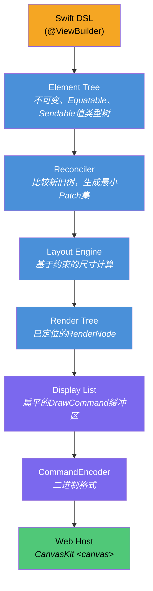
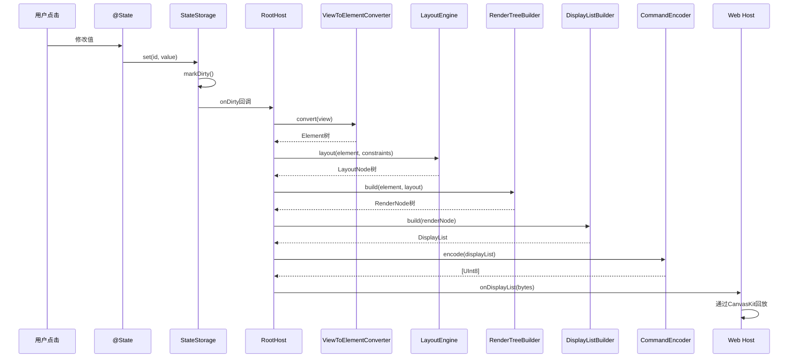
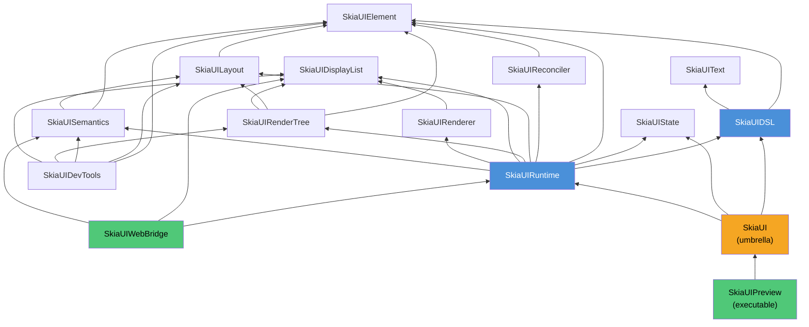

# SkiaUI

用Swift编写的声明式UI引擎。在Web上通过[Skia (CanvasKit)](https://skia.org/docs/user/modules/canvaskit/)进行渲染。编写SwiftUI风格的代码，在HTML Canvas上绘制像素级精确的UI。

**[English](../README.md)** | **[한국어](README_ko.md)** | **[日本語](README_ja.md)**

```swift
struct CounterView: View {
    @State private var count = 0

    var body: some View {
        VStack(spacing: 16) {
            Text("Count: \(count)")
                .font(size: 32)
                .foregroundColor(.blue)

            HStack(spacing: 16) {
                Text("- Decrease")
                    .padding(12)
                    .background(.red)
                    .foregroundColor(.white)
                    .onTapGesture { count -= 1 }

                Text("+ Increase")
                    .padding(12)
                    .background(.blue)
                    .foregroundColor(.white)
                    .onTapGesture { count += 1 }
            }
        }
        .padding(32)
    }
}
```

## 为什么选择SkiaUI

Swift开发者要构建Web UI，要么转向JavaScript技术栈，要么接受以DOM为中心的渲染限制。

SkiaUI选择了不同的道路：

- **Swift作为唯一的UI语言** -- 声明式ResultBuilder DSL、`@State`、modifier
- **基于Canvas的渲染** -- 不是DOM元素，而是通过Skia绘图命令直接在`<canvas>`上绘制
- **渲染器无关的核心** -- DSL和布局引擎完全不知道CanvasKit的存在。无需修改用户代码即可添加原生Skia或Metal后端

## 架构

核心设计原则是**声明、计算、绘制的严格分离**。DSL不与渲染器对话。渲染器不解析视图代码。二进制显示列表位于边界之上。



每一层都是独立的Swift模块，在`Package.swift`中定义了明确的依赖边界。任何一层都可以单独替换或测试。

### 状态变更时的数据流



### 模块依赖图



## 模块映射

```text
SkiaUI (umbrella)
  @_exported import SkiaUIDSL
  @_exported import SkiaUIState
  @_exported import SkiaUIRuntime

SkiaUIDSL           -> [SkiaUIElement, SkiaUIText]
  View协议、@ViewBuilder、PrimitiveView协议
  Primitives:   Text, Rectangle, Spacer, EmptyView
  Containers:   VStack, HStack, ZStack
  Modifiers:    padding, frame, background, foregroundColor, font,
                onTapGesture, accessibilityLabel/Role/Hint/Hidden
  Types:        Color, Alignment, EdgeInsets, Rect
  AnyView, ConditionalView, TupleView2, ViewToElementConverter

SkiaUIElement       -> (无依赖)
  Element (indirect enum), ElementID, ElementTree

SkiaUIText          -> (无依赖)
  FontDescriptor, FontWeight, TextStyle, ParagraphSpec

SkiaUIState         -> (无依赖)
  @State, Binding, StateStorage, Environment, Scheduler

SkiaUIReconciler    -> [SkiaUIElement]
  Reconciler, Patch, ElementPath, DirtyTracker

SkiaUILayout        -> [SkiaUIElement]
  LayoutEngine, LayoutNode, Constraints
  LayoutStrategy协议, VStackLayout, HStackLayout, ZStackLayout

SkiaUIRenderTree    -> [SkiaUIElement, SkiaUILayout, SkiaUIDisplayList]
  RenderNode, RenderTreeBuilder, DisplayListBuilder
  PaintStyle, TextContent, Transform, Clip

SkiaUIDisplayList   -> (无依赖)
  DisplayList, DrawCommand, CommandEncoder, RetainedSubtree

SkiaUIRenderer      -> [SkiaUIDisplayList]
  RendererBackend协议, RendererConfig, TextMetrics

SkiaUISemantics     -> [SkiaUIElement, SkiaUILayout]
  SemanticsNode, SemanticsTreeBuilder, SemanticsRole
  SemanticsAction, SemanticsUpdate

SkiaUIRuntime       -> [SkiaUIDSL, SkiaUIState, SkiaUIElement,
                        SkiaUIReconciler, SkiaUILayout, SkiaUIRenderTree,
                        SkiaUIDisplayList, SkiaUIRenderer, SkiaUISemantics]
  App协议, RootHost, FrameLoop

SkiaUIWebBridge     -> [SkiaUIRuntime, SkiaUIDisplayList, SkiaUISemantics]
  WebBridge, JSHostBinding, DisplayListExport, SemanticsExport
  (JavaScriptKit依赖 -- 仅隔离于此，Wasm专用)

SkiaUIDevTools      -> [SkiaUIElement, SkiaUILayout, SkiaUISemantics,
                        SkiaUIRenderTree, SkiaUIDisplayList]
  TreeInspector, DebugOverlay, SemanticsInspector

SkiaUIPreview       -> [SkiaUI]  (可执行目标)
  向WebHost提供显示列表的HTTP服务器
```

核心模块无外部依赖。`JavaScriptKit`仅在WebAssembly构建时由`SkiaUIWebBridge`使用。

## 核心设计决策

### Element：设计为indirect enum

```swift
public indirect enum Element: Equatable, Sendable {
    case empty
    case text(String, TextProperties)
    case rectangle(RectangleProperties)
    case spacer(minLength: Float?)
    case container(ContainerProperties, children: [Element])
    case modified(Element, Modifier)
}
```

整个UI树是一个单一的值类型`Equatable`结构。这使得diff变得简单，序列化变得直观，快照测试变得自然。没有引用类型，Element层面无需identity管理。

`Element.Modifier`将所有modifier编码为扁平的enum case：

```swift
public enum Modifier: Equatable, Sendable {
    case padding(top: Float, leading: Float, bottom: Float, trailing: Float)
    case frame(width: Float?, height: Float?, alignment: Int)
    case background(ElementColor)
    case foregroundColor(ElementColor)
    case font(size: Float, weight: Int)
    case onTap(id: Int)
    case accessibilityLabel(String)
    case accessibilityRole(String)
    case accessibilityHint(String)
    case accessibilityHidden(Bool)
}
```

### 基于约束的布局

```swift
public struct Constraints: Equatable, Sendable {
    var minWidth, maxWidth, minHeight, maxHeight: Float

    func constrain(width: Float, height: Float) -> (width: Float, height: Float)
    func inset(top:leading:bottom:trailing:) -> Constraints
    func withExactWidth(_ width: Float) -> Constraints
    func withExactHeight(_ height: Float) -> Constraints
}

public protocol LayoutStrategy: Sendable {
    func layout(children: [Element], constraints: Constraints,
                measure: (Element, Constraints) -> LayoutNode) -> LayoutNode
}
```

每种栈类型（`VStackLayout`、`HStackLayout`、`ZStackLayout`）实现`LayoutStrategy`。引擎向下传播约束，子元素向上报告尺寸。Spacer吸收剩余空间。影响布局的modifier（`padding`、`frame`）将内部布局包装为子元素；透明modifier（`background`、`foregroundColor`、`onTap`、`font`、无障碍）直接透传布局。

### 显示列表：渲染边界

```swift
public enum DrawCommand: Equatable, Sendable {
    case save
    case restore
    case translate(x: Float, y: Float)
    case clipRect(x: Float, y: Float, width: Float, height: Float)
    case drawRect(x: Float, y: Float, width: Float, height: Float, color: UInt32)
    case drawRRect(x: Float, y: Float, width: Float, height: Float, radius: Float, color: UInt32)
    case drawText(text: String, x: Float, y: Float, fontSize: Float,
                  fontWeight: Int, color: UInt32, boundsWidth: Float)
    case retainedSubtreeBegin(id: Int, version: Int)
    case retainedSubtreeEnd
}
```

显示列表是**跨越Swift-JavaScript边界的唯一数据**。`CommandEncoder`将其序列化为紧凑的二进制格式：

| 字段 | 格式 | 大小 |
| ---- | ---- | ---- |
| 头部版本 | `Int32` | 4字节 |
| 头部命令数 | `Int32` | 4字节 |
| 命令opcode | `UInt8` | 1字节 |
| 命令参数 | `Float32` / `Int32` / `UInt32` / 长度前缀UTF-8 | 可变 |

opcode为1-9，所有值为小端序。TypeScript `DisplayListPlayer`直接从`ArrayBuffer`读取此格式并作为CanvasKit API调用回放 -- 零对象编组，零JSON解析。

### 渲染树

```swift
public final class RenderNode: @unchecked Sendable {
    var frame: (x: Float, y: Float, width: Float, height: Float)
    var paintStyle: PaintStyle?        // fillColor: UInt32?, cornerRadius: Float
    var textContent: TextContent?      // text, fontSize, fontWeight, color (ARGB UInt32)
    var children: [RenderNode]
    var clipToBounds: Bool
}
```

`RenderTreeBuilder`同时遍历`Element`树和`LayoutNode`树，生成已定位的`RenderNode`。`DisplayListBuilder`然后从渲染树以save/translate/draw/restore模式发出绘图命令。

### Reconciler

```swift
public enum Patch: Equatable, Sendable {
    case insert(path: ElementPath, element: Element)
    case delete(path: ElementPath)
    case update(path: ElementPath, from: Element, to: Element)
    case replace(path: ElementPath, from: Element, to: Element)
}
```

`ElementPath`以`[Int]`索引编码树位置。`DirtyTracker`标记路径及其祖先以执行目标re-layout。

### 响应式状态

```swift
@propertyWrapper
public struct State<Value: Sendable>: Sendable where Value: Equatable {
    public var wrappedValue: Value { get nonmutating set }
    public var projectedValue: Binding<Value> { get }
}
```

`@State`由全局`StateStorage`（基于`NSLock`的线程安全）支撑。变更时与旧值比较，仅实际变更触发`markDirty()`，通过`onDirty`回调执行重新渲染。`RootHost`连接此回调以触发完整的渲染流程。

### ViewBuilder (SE-0348)

```swift
@resultBuilder
public struct ViewBuilder {
    static func buildBlock() -> EmptyView
    static func buildPartialBlock<V: View>(first: V) -> V
    static func buildPartialBlock<A: View, V: View>(accumulated: A, next: V) -> TupleView2<A, V>
    static func buildOptional<V: View>(_ component: V?) -> ConditionalView<V, EmptyView>
    static func buildEither<T: View, F: View>(first: T) -> ConditionalView<T, F>
    static func buildEither<T: View, F: View>(second: F) -> ConditionalView<T, F>
}
```

使用`buildPartialBlock`（SE-0348）支持无限子元素。`TupleView2`通过`TupleViewProtocol`将嵌套对展平为扁平子数组。`ConditionalView`通过嵌套的`buildEither`调用处理`if`/`else if`/`else`链。

## DSL接口

### 基本视图

| 视图 | 描述 |
| ---- | ---- |
| `Text("Hello")` | 带样式的文本节点 |
| `Rectangle()` | 纯色或圆角矩形 |
| `Spacer()` | 栈内弹性空间 |
| `EmptyView()` | 零尺寸占位符 |

### 容器

| 视图 | 描述 |
| ---- | ---- |
| `VStack(alignment:spacing:)` | 垂直布局（对齐：`.leading`, `.center`, `.trailing`） |
| `HStack(alignment:spacing:)` | 水平布局（对齐：`.top`, `.center`, `.bottom`） |
| `ZStack(alignment:)` | 叠加/层叠布局（9点对齐） |

### View modifier

| Modifier | 示例 |
| -------- | ---- |
| `.padding(_:)` | `.padding(16)` 或 `.padding(top: 8, leading: 16, bottom: 8, trailing: 16)` |
| `.frame(width:height:)` | `.frame(width: 200, height: 100)` |
| `.background(_:)` | `.background(.blue)` |
| `.foregroundColor(_:)` | `.foregroundColor(.white)` |
| `.font(size:weight:)` | `.font(size: 24, weight: .bold)` |
| `.onTapGesture { }` | `.onTapGesture { count += 1 }` |
| `.accessibilityLabel(_:)` | `.accessibilityLabel("关闭按钮")` |
| `.accessibilityRole(_:)` | `.accessibilityRole("button")` |
| `.accessibilityHint(_:)` | `.accessibilityHint("双击关闭")` |
| `.accessibilityHidden(_:)` | `.accessibilityHidden(true)` |

### Rectangle专用modifier

| Modifier | 示例 |
| -------- | ---- |
| `.fill(_:)` | `Rectangle().fill(.red)` |
| `.cornerRadius(_:)` | `Rectangle().fill(.orange).cornerRadius(12)` |

### 类型

| 类型 | 值 |
| ---- | -- |
| `Color` | `.red`, `.blue`, `.green`, `.orange`, `.purple`, `.yellow`, `.gray`, `.black`, `.white`, `.clear` |
| `Color(red:green:blue:)` | `Color(red: 0.2, green: 0.6, blue: 0.9)` |
| `Color(white:)` | `Color(white: 0.75)` |
| `FontWeight` | `.ultraLight`, `.thin`, `.light`, `.regular`, `.medium`, `.semibold`, `.bold`, `.heavy`, `.black` |
| `HorizontalAlignment` | `.leading`, `.center`, `.trailing` |
| `VerticalAlignment` | `.top`, `.center`, `.bottom` |

## Web Host

TypeScript Web主机（`WebHost/`）被有意设计得很薄。它的职责仅有以下四项：

1. **引导** -- 加载CanvasKit WASM，创建基于WebGL的`<canvas>`，加载字体
2. **回放** -- 读取二进制显示列表并调用CanvasKit绘制方法
3. **事件转发** -- 将指针/点击坐标转发给Swift进行命中测试
4. **视口同步** -- 浏览器调整大小时通知Swift

主机对UI树、布局、状态一无所知。它只是一个显示列表播放器。

```text
WebHost/
  package.json              canvaskit-wasm, vite, typescript
  vite.config.ts
  index.html
  src/
    main.ts                 入口点
    bootstrap.ts            CanvasKit初始化序列
    canvaskitHost.ts        Surface创建、帧循环、视口同步
    canvaskitBackend.ts     Canvas API包装器
    displayListPlayer.ts    二进制缓冲区 -> CanvasKit API调用
    eventBridge.ts          指针/点击事件委托
    debugOverlay.ts         FPS和调试可视化
    semanticsOverlay.ts     无障碍树覆盖层
```

## 快速开始

### 前提条件

- Swift 6.2+
- macOS 14.0+
- Node.js / pnpm（用于Web主机）

### 构建与运行

```bash
# 构建所有模块
swift build

# 运行测试（7个套件，49个测试）
swift test

# 启动预览服务器（通过HTTP :3001提供显示列表）
swift run SkiaUIPreview

# 在另一个终端启动Web主机开发服务器
cd WebHost && pnpm install && pnpm dev
```

在浏览器中打开`http://localhost:5173`。仪表板显示5个示例视图（Counter、Typography、Shapes & Colors、Layout、Accessibility），演示完整的DSL接口。

## 项目状态

SkiaUI处于早期开发阶段。当前实现范围：

- [x] 基于`@ViewBuilder`的ResultBuilder DSL（SE-0348 `buildPartialBlock`）
- [x] 4个基本视图（`Text`、`Rectangle`、`Spacer`、`EmptyView`）
- [x] 3个容器视图（`VStack`、`HStack`、`ZStack`）
- [x] 10个view modifier + 2个Rectangle专用modifier
- [x] `@State`响应性与自动重新渲染
- [x] 可插拔`LayoutStrategy`的基于约束的布局引擎
- [x] 基于最小diff的树协调（`Patch`、`DirtyTracker`）
- [x] 二进制显示列表编码/解码（`CommandEncoder`）
- [x] 通过TypeScript主机的CanvasKit Web渲染
- [x] 基于Z-order正确命中测试的点击事件处理
- [x] 无障碍语义树（`SemanticsNode`、`SemanticsTreeBuilder`）
- [x] 7个套件，49个测试

### 路线图

- [ ] ScrollView / List
- [ ] 动画系统
- [ ] 图片支持
- [ ] 键盘 / 焦点管理
- [ ] 无障碍DOM覆盖层
- [ ] 原生Skia后端（Metal / Vulkan）
- [ ] Hot reload

## 许可证

MIT
