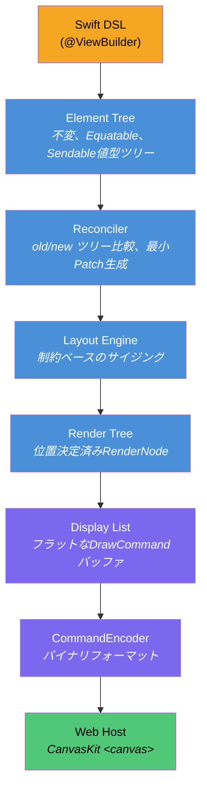
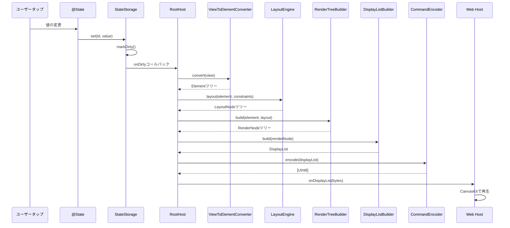
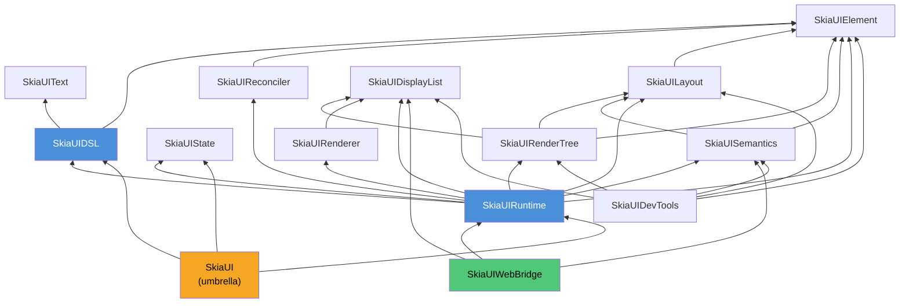

# SkiaUI

Swiftで書く宣言型UIエンジン。Webでは[Skia (CanvasKit)](https://skia.org/docs/user/modules/canvaskit/)でレンダリングします。SwiftUIスタイルのコードを書き、HTML Canvas上にピクセル単位で正確なUIを描画します。

**[English](/)** | **[한국어](/ko/)** | **[中文](/zh/)**

```swift
struct CounterView: View {
    @State private var count = 0

    var body: some View {
        VStack(spacing: 16) {
            Text("Count: \(count)")
                .font(size: 32)
                .foregroundColor(.blue)

            HStack(spacing: 16) {
                Text("- Decrease")
                    .padding(12)
                    .background(.red)
                    .foregroundColor(.white)
                    .onTapGesture { count -= 1 }

                Text("+ Increase")
                    .padding(12)
                    .background(.blue)
                    .foregroundColor(.white)
                    .onTapGesture { count += 1 }
            }
        }
        .padding(32)
    }
}
```

## なぜSkiaUIなのか

Swift開発者がWeb UIを構築するには、JavaScriptベースのスタックに移行するか、DOM中心のレンダリングの制約を受け入れるしかありません。

SkiaUIは異なるアプローチを取ります：

- **Swiftを単一のUI言語に** -- 宣言型ResultBuilder DSL、`@State`、modifier
- **Canvasベースレンダリング** -- DOM要素ではなく、Skia描画コマンドで`<canvas>`に直接描画
- **レンダラー非依存コア** -- DSLとレイアウトエンジンはCanvasKitを一切知らない。ネイティブSkiaやMetalバックエンドをユーザーコード変更なしで追加可能

## アーキテクチャ

核心的な設計原則は**宣言、計算、描画の厳格な分離**です。DSLはレンダラーと会話しません。レンダラーはビューコードをパースしません。バイナリディスプレイリストがその境界に位置します。



各レイヤーは独立したSwiftモジュールであり、`Package.swift`に明示的な依存境界が定義されています。どのレイヤーも単独で交換・テスト可能です。

### 状態変更時のデータフロー



### モジュール依存グラフ



## モジュールマップ

```text
SkiaUI (umbrella)
  @_exported import SkiaUIDSL
  @_exported import SkiaUIState
  @_exported import SkiaUIRuntime

SkiaUIDSL           -> [SkiaUIElement, SkiaUIText]
  Viewプロトコル、@ViewBuilder、PrimitiveViewプロトコル
  Primitives:   Text, Rectangle, Spacer, EmptyView
  Containers:   VStack, HStack, ZStack, ScrollView
  Modifiers:    padding, frame, background, foregroundColor, font,
                onTapGesture, layoutPriority, fixedSize, drawingGroup,
                accessibilityLabel/Role/Hint/Hidden
  Types:        Color, Alignment, EdgeInsets, Rect
  AnyView, ConditionalView, TupleView2, ViewToElementConverter
```

コアモジュールに外部依存はありません。`JavaScriptKit`はWebAssemblyビルド時に`SkiaUIWebBridge`でのみ使用されます。

## 核心設計決定

### Element: indirect enumとして設計

```swift
public indirect enum Element: Hashable, Sendable {
    case empty
    case text(String, TextProperties)
    case rectangle(RectangleProperties)
    case spacer(minLength: Float?)
    case container(ContainerProperties, children: [Element])
    case modified(Element, Modifier)
}
```

UIツリー全体が単一の値型`Equatable`構造体です。diffが簡単で、シリアライズが直感的で、スナップショットテストが自然です。参照型なし、Element レベルのidentity管理なし。

### 制約ベースレイアウト

```swift
public struct Constraints: Equatable, Sendable {
    var minWidth, maxWidth, minHeight, maxHeight: Float
}

public protocol LayoutStrategy: Sendable {
    func layout(children: [Element], constraints: Constraints,
                measure: (Element, Constraints) -> LayoutNode) -> LayoutNode
}
```

各スタックタイプ（`VStackLayout`、`HStackLayout`、`ZStackLayout`）が`LayoutStrategy`を実装します。

### ディスプレイリスト：レンダリング境界

ディスプレイリストは**Swift-JavaScript境界を越える唯一のデータ**です。`CommandEncoder`がコンパクトなバイナリフォーマットにシリアライズします。

### レンダーツリー

`RenderTreeBuilder`が`Element`ツリーと`LayoutNode`ツリーを同時に走査し、位置決定済みの`RenderNode`を生成します。

### Reconciler

`ElementPath`はツリー位置を`[Int]`インデックスでエンコードします。`DirtyTracker`はパスとその祖先をマーキングしてターゲットre-layoutを実行します。

### リアクティブ状態

`@State`はグローバル`StateStorage`（`NSLock`ベースのスレッドセーフ）に支えられています。変更時に前の値と比較し、実際の変更のみ`markDirty()`をトリガーします。`AttributeGraph`（Eval/viteアルゴリズム）がcomposite Viewごとの`@State`依存を追跡し、Elementサブツリーをキャッシュして、入力が変わらないViewのbody再実行をスキップします。

### ViewBuilder (SE-0348)

`buildPartialBlock`（SE-0348）を使用して無制限の子をサポートします。

## DSLインターフェース

### Primitives

| ビュー | 説明 |
| ------ | ---- |
| `Text("Hello")` | スタイル付きテキストノード |
| `Rectangle()` | 単色または角丸の矩形 |
| `Spacer()` | スタック内のフレキシブルスペース |
| `EmptyView()` | サイズゼロのプレースホルダー |

### Containers

| ビュー | 説明 |
| ------ | ---- |
| `VStack(alignment:spacing:)` | 垂直レイアウト |
| `HStack(alignment:spacing:)` | 水平レイアウト |
| `ZStack(alignment:)` | オーバーレイ/レイヤーレイアウト |
| `ScrollView(_:)` | スクロール可能コンテナ（`.vertical`または`.horizontal`） |

### View modifier

| Modifier | 例 |
| -------- | -- |
| `.padding(_:)` | `.padding(16)` |
| `.frame(width:height:)` | `.frame(width: 200, height: 100)` |
| `.background(_:)` | `.background(.blue)` |
| `.foregroundColor(_:)` | `.foregroundColor(.white)` |
| `.font(size:weight:)` | `.font(size: 24, weight: .bold)` |
| `.font(_:)` | `.font(.custom("Monaspace Neon", size: 16))` |
| `.fontFamily(_:)` | `.fontFamily("Courier")` (Text専用) |
| `.onTapGesture { }` | `.onTapGesture { count += 1 }` |
| `.accessibilityLabel(_:)` | `.accessibilityLabel("閉じるボタン")` |
| `.drawingGroup()` | `.drawingGroup()` |

### Rectangle専用modifier

| Modifier | 例 |
| -------- | -- |
| `.fill(_:)` | `Rectangle().fill(.red)` |
| `.cornerRadius(_:)` | `Rectangle().fill(.orange).cornerRadius(12)` |

### 型

| 型 | 値 |
| -- | -- |
| `Color` | `.red`, `.blue`, `.green`, `.orange`, `.purple`, `.yellow`, `.gray`, `.black`, `.white`, `.clear` |
| `FontWeight` | `.ultraLight`, `.thin`, `.light`, `.regular`, `.medium`, `.semibold`, `.bold`, `.heavy`, `.black` |
| `Font` | `.largeTitle`, `.title`, `.headline`, `.body`, `.caption`, `.custom("Name", size:)`, `.system(size:weight:design:)` |
| `Font.Design` | `.default`, `.monospaced`, `.rounded`, `.serif` |

## Web Client

`WebClient/`にはCanvasKitを介してバイナリディスプレイリストを再生するTypeScriptクライアントライブラリが含まれています。UIツリー、レイアウト、状態について一切知りません。

## 始め方

### 前提条件

- Swift 6.2+
- macOS 14.0+
- Node.js / pnpm（WebClient用）

### ビルドと実行

```bash
swift build
swift test
```

## サーバー統合

SkiaUIはサーバー（例：[Vapor](https://vapor.codes)）でパッケージ依存として使用できます。サーバーが完全なレンダリングパイプラインを実行し、結果の`[UInt8]`バイナリをHTTPで送信します。ブラウザクライアントはそのバイナリをfetchし、`DisplayListPlayer`で`<canvas>`上に再生します。

### 1. 依存関係の追加

```swift
// Package.swift
dependencies: [
    .package(url: "https://github.com/devyhan/SkiaUI.git", branch: "main")
],
targets: [
    .executableTarget(name: "MyApp", dependencies: [
        .product(name: "SkiaUI", package: "SkiaUI")
    ])
]
```

### 2. Viewのレンダリング

```swift
import SkiaUI

let host = RootHost()
host.setViewport(width: 800, height: 600)

var bytes: [UInt8] = []
host.setOnDisplayList { bytes = $0 }
host.render(CounterView())
// `bytes`にバイナリディスプレイリストが格納される
```

### 3. HTTP配信

```swift
// Vaporの例
app.get("display-list") { req -> Response in
    var bytes: [UInt8] = []
    host.setOnDisplayList { bytes = $0 }
    host.render(MyView())
    return Response(
        status: .ok,
        headers: ["Content-Type": "application/octet-stream"],
        body: .init(data: Data(bytes))
    )
}
```

### 4. ブラウザクライアント

`WebClient/`の静的ファイルをサーバーのpublicディレクトリにコピーし、fetchして再生します：

```js
const resp = await fetch('/display-list');
const buffer = await resp.arrayBuffer();
player.play(buffer, canvas);
```

## プロジェクト状態

SkiaUIは初期開発段階です。

- [x] `@ViewBuilder`ベースのResultBuilder DSL
- [x] 4つのprimitiveビュー
- [x] 4つのcontainerビュー（`VStack`、`HStack`、`ZStack`、`ScrollView`）
- [x] 15個のview modifier + 2個のRectangle専用modifier
- [x] `@State`リアクティビティと自動再レンダリング
- [x] 制約ベースのレイアウトエンジン
- [x] 最小diff基盤のツリー再調整
- [x] バイナリディスプレイリストエンコーディング/デコーディング
- [x] CanvasKitウェブレンダリング
- [x] Z-order正確なヒットテスト
- [x] アクセシビリティセマンティクスツリー

### ロードマップ

- [ ] List
- [ ] アニメーションシステム
- [ ] 画像サポート
- [ ] キーボード / フォーカス管理
- [ ] アクセシビリティDOMオーバーレイ
- [ ] ネイティブSkiaバックエンド（Metal / Vulkan）
- [ ] Hot reload

## ライセンス

MIT — 詳細は [LICENSE](https://github.com/devyhan/SkiaUI/blob/main/LICENSE) をご覧ください。

サードパーティライセンスは [THIRD_PARTY_NOTICES](https://github.com/devyhan/SkiaUI/blob/main/THIRD_PARTY_NOTICES) に記載されています。
