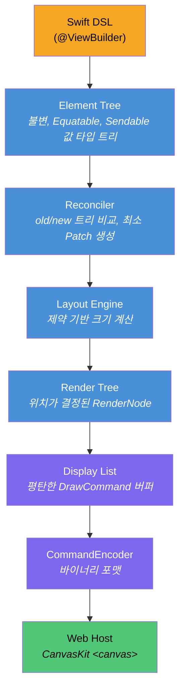
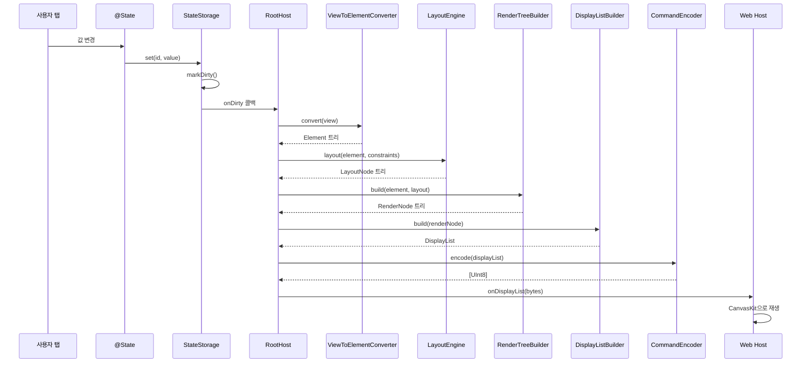
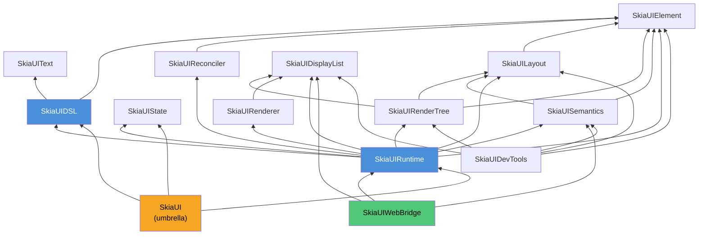

# SkiaUI

Swift로 작성하는 선언형 UI 엔진. 웹에서는 [Skia (CanvasKit)](https://skia.org/docs/user/modules/canvaskit/)로 렌더링합니다. SwiftUI 스타일 코드를 작성하고, HTML Canvas 위에 픽셀 단위로 정확한 UI를 그립니다.

**[English](/)** | **[日本語](/ja/)** | **[中文](/zh/)**

```swift
struct CounterView: View {
    @State private var count = 0

    var body: some View {
        VStack(spacing: 16) {
            Text("Count: \(count)")
                .font(size: 32)
                .foregroundColor(.blue)

            HStack(spacing: 16) {
                Text("- Decrease")
                    .padding(12)
                    .background(.red)
                    .foregroundColor(.white)
                    .onTapGesture { count -= 1 }

                Text("+ Increase")
                    .padding(12)
                    .background(.blue)
                    .foregroundColor(.white)
                    .onTapGesture { count += 1 }
            }
        }
        .padding(32)
    }
}
```

## SkiaUI를 만드는 이유

Swift 개발자가 웹 UI를 만들려면 JavaScript 기반 스택으로 전환하거나, DOM 중심 렌더링의 제한을 감수해야 합니다.

SkiaUI는 다른 길을 선택합니다:

- **Swift를 단일 UI 언어로** -- 선언형 ResultBuilder DSL, `@State`, modifier
- **Canvas 기반 렌더링** -- DOM 요소가 아닌 Skia 드로잉 명령으로 `<canvas>`에 직접 그리기
- **렌더러 비의존 코어** -- DSL과 레이아웃 엔진은 CanvasKit을 전혀 모름. 네이티브 Skia나 Metal 백엔드를 사용자 코드 변경 없이 추가 가능

## 아키텍처

핵심 설계 원칙은 **선언, 연산, 드로잉의 엄격한 분리**입니다. DSL은 렌더러와 대화하지 않습니다. 렌더러는 뷰 코드를 파싱하지 않습니다. 바이너리 디스플레이 리스트가 그 경계에 위치합니다.



각 레이어는 별도의 Swift 모듈이며 `Package.swift`에 명시적 의존성 경계가 정의되어 있습니다. 어떤 레이어든 단독으로 교체하거나 테스트할 수 있습니다.

### 상태 변경 시 데이터 흐름



### 모듈 의존성 그래프



## 모듈 맵

```text
SkiaUI (umbrella)
  @_exported import SkiaUIDSL
  @_exported import SkiaUIState
  @_exported import SkiaUIRuntime

SkiaUIDSL           -> [SkiaUIElement, SkiaUIText]
  View 프로토콜, @ViewBuilder, PrimitiveView 프로토콜
  Primitives:   Text, Rectangle, Spacer, EmptyView
  Containers:   VStack, HStack, ZStack, ScrollView
  Modifiers:    padding, frame, background, foregroundColor, font,
                onTapGesture, layoutPriority, fixedSize,
                accessibilityLabel/Role/Hint/Hidden
  Types:        Color, Alignment, EdgeInsets, Rect, Axis
  AnyView, ConditionalView, TupleView2, ViewToElementConverter

SkiaUIElement       -> (의존성 없음)
  Element (indirect enum), ElementID, ElementTree

SkiaUIText          -> (의존성 없음)
  Font, FontDescriptor, FontWeight, TextStyle, ParagraphSpec

SkiaUIState         -> (의존성 없음)
  @State, Binding, StateStorage, ScrollOffsetStorage, Environment, Scheduler
  AttributeGraph, AttributeNodeID, DependencyRecorder, AnyHashableSendable

SkiaUIReconciler    -> [SkiaUIElement]
  Reconciler, Patch, ElementPath, DirtyTracker

SkiaUILayout        -> [SkiaUIElement]
  LayoutEngine, LayoutNode, ProposedSize, Constraints
  LayoutStrategy 프로토콜, VStackLayout, HStackLayout, ZStackLayout, ScrollViewLayout

SkiaUIRenderTree    -> [SkiaUIElement, SkiaUILayout, SkiaUIDisplayList]
  RenderNode, RenderTreeBuilder, DisplayListBuilder
  PaintStyle, TextContent, Transform, Clip

SkiaUIDisplayList   -> (의존성 없음)
  DisplayList, DrawCommand, CommandEncoder, RetainedSubtree

SkiaUIRenderer      -> [SkiaUIDisplayList]
  RendererBackend 프로토콜, RendererConfig, TextMetrics

SkiaUISemantics     -> [SkiaUIElement, SkiaUILayout]
  SemanticsNode, SemanticsTreeBuilder, SemanticsRole
  SemanticsAction, SemanticsUpdate

SkiaUIRuntime       -> [SkiaUIDSL, SkiaUIState, SkiaUIElement,
                        SkiaUIReconciler, SkiaUILayout, SkiaUIRenderTree,
                        SkiaUIDisplayList, SkiaUIRenderer, SkiaUISemantics]
  App 프로토콜, RootHost, FrameLoop

SkiaUIWebBridge     -> [SkiaUIRuntime, SkiaUIDisplayList, SkiaUISemantics]
  WebBridge, JSHostBinding, DisplayListExport, SemanticsExport
  (JavaScriptKit 의존성 -- 여기에만 격리, Wasm 전용)

SkiaUIDevTools      -> [SkiaUIElement, SkiaUILayout, SkiaUISemantics,
                        SkiaUIRenderTree, SkiaUIDisplayList]
  TreeInspector, DebugOverlay, SemanticsInspector

```

코어 모듈에는 외부 의존성이 없습니다. `JavaScriptKit`은 WebAssembly 빌드 시 `SkiaUIWebBridge`에서만 사용됩니다.

## 핵심 설계 결정

### Element: indirect enum으로 설계

```swift
public indirect enum Element: Hashable, Sendable {
    case empty
    case text(String, TextProperties)
    case rectangle(RectangleProperties)
    case spacer(minLength: Float?)
    case container(ContainerProperties, children: [Element])
    case modified(Element, Modifier)
}
```

전체 UI 트리가 단일 값 타입 `Equatable` 구조체입니다. 덕분에 diff가 간단하고, 직렬화가 직관적이며, 스냅샷 테스트가 자연스럽습니다. 참조 타입 없음, Element 수준의 identity 관리 없음.

`Element.Modifier`는 모든 modifier를 플랫한 enum case로 인코딩합니다:

```swift
public enum Modifier: Hashable, Sendable {
    case padding(top: Float, leading: Float, bottom: Float, trailing: Float)
    case frame(FrameProperties)             // min/ideal/max 유연 프레임
    case background(ElementColor)
    case foregroundColor(ElementColor)
    case font(size: Float, weight: Int, family: String? = nil)
    case onTap(id: Int)
    case accessibilityLabel(String)
    case accessibilityRole(String)
    case accessibilityHint(String)
    case accessibilityHidden(Bool)
    case layoutPriority(Double)             // 스택 공간 분배 우선순위
    case fixedSize(horizontal: Bool, vertical: Bool)  // 제안 무시, 고유 크기 사용
    case drawingGroup
}
```

### ProposedSize 기반 레이아웃 (SwiftUI 호환)

> 레이아웃 시스템의 상세 설계와 알고리즘은 [레이아웃 시스템 아키텍처](ko/layout-system)를 참조하세요.

```swift
public struct ProposedSize: Equatable, Sendable {
    var width: Float?    // nil = "이상적 크기 사용"
    var height: Float?

    static let zero        // 최소 크기 측정용
    static let unspecified  // 이상적 크기 요청
    static let infinity    // 최대 크기 측정용
}

public protocol LayoutStrategy: Sendable {
    func layout(children: [Element], proposal: ProposedSize,
                measure: (Element, ProposedSize) -> LayoutNode) -> LayoutNode
}
```

SwiftUI와 동일한 **ProposedSize 기반 크기 협상** 모델을 사용합니다. 부모가 가용 공간을 제안하면, 자식이 실제 사용할 크기를 응답합니다. `nil`은 "이상적 크기를 사용하라"는 의미입니다.

각 스택 타입(`VStackLayout`, `HStackLayout`, `ZStackLayout`)이 `LayoutStrategy`를 구현합니다. 스택은 **우선순위+유연성 기반 공간 분배** 알고리즘으로 자식에게 공간을 할당합니다:

1. 각 자식의 `layoutPriority`를 추출 (Spacer는 `-∞`)
2. 최소/최대 크기를 측정하여 유연성(flexibility) 계산
3. 높은 우선순위 그룹부터 공간 분배, 유연성 낮은 자식 먼저 확정
4. Spacer는 가장 마지막에 남은 공간을 수령

레이아웃에 영향을 주는 modifier(`padding`, `frame`)는 래퍼 LayoutNode를 생성하고, `fixedSize`는 제안을 nil로 대체하여 고유 크기를 사용하게 합니다. 투명 modifier(`background`, `foregroundColor`, `onTap`, `font`, 접근성)는 레이아웃을 그대로 통과시킵니다.

### 디스플레이 리스트: 렌더링 경계

```swift
public enum DrawCommand: Equatable, Sendable {
    case save
    case restore
    case translate(x: Float, y: Float)
    case clipRect(x: Float, y: Float, width: Float, height: Float)
    case drawRect(x: Float, y: Float, width: Float, height: Float, color: UInt32)
    case drawRRect(x: Float, y: Float, width: Float, height: Float, radius: Float, color: UInt32)
    case drawText(text: String, x: Float, y: Float, fontSize: Float,
                  fontWeight: Int, color: UInt32, boundsWidth: Float,
                  fontFamily: String? = nil)
    case retainedSubtreeBegin(id: Int, version: Int)
    case retainedSubtreeEnd
}
```

디스플레이 리스트는 **Swift-JavaScript 경계를 넘는 유일한 데이터**입니다. `CommandEncoder`가 컴팩트한 바이너리 포맷으로 직렬화합니다:

| 필드 | 포맷 | 크기 |
| ---- | ---- | ---- |
| 헤더 버전 | `Int32` | 4바이트 |
| 헤더 명령 수 | `Int32` | 4바이트 |
| 명령 opcode | `UInt8` | 1바이트 |
| 명령 파라미터 | `Float32` / `Int32` / `UInt32` / 길이 접두 UTF-8 | 가변 |

opcode는 1-9, 모든 값은 리틀 엔디안. TypeScript `DisplayListPlayer`가 이 포맷을 `ArrayBuffer`에서 직접 읽어 CanvasKit API 호출로 재생합니다 -- 객체 마샬링 없음, JSON 파싱 없음.

### 렌더 트리

```swift
public final class RenderNode: @unchecked Sendable {
    var frame: (x: Float, y: Float, width: Float, height: Float)
    var paintStyle: PaintStyle?        // fillColor: UInt32?, cornerRadius: Float
    var textContent: TextContent?      // text, fontSize, fontWeight, color (ARGB UInt32)
    var children: [RenderNode]
    var clipToBounds: Bool
}
```

`RenderTreeBuilder`가 `Element` 트리와 `LayoutNode` 트리를 함께 순회하며 위치가 결정된 `RenderNode`를 생성합니다. `DisplayListBuilder`는 렌더 트리에서 save/translate/draw/restore 패턴으로 드로우 명령을 방출합니다.

### Reconciler

```swift
public enum Patch: Equatable, Sendable {
    case insert(path: ElementPath, element: Element)
    case delete(path: ElementPath)
    case update(path: ElementPath, from: Element, to: Element)
    case replace(path: ElementPath, from: Element, to: Element)
}
```

`ElementPath`는 트리 위치를 `[Int]` 인덱스로 인코딩합니다. `DirtyTracker`는 경로와 그 조상을 마킹하여 타겟 re-layout을 수행합니다.

### 반응형 상태

```swift
@propertyWrapper
public struct State<Value: Sendable>: Sendable where Value: Equatable {
    public var wrappedValue: Value { get nonmutating set }
    public var projectedValue: Binding<Value> { get }
}
```

`@State`는 전역 `StateStorage`(`NSLock` 기반 스레드 안전)가 뒷받침합니다. 변경 시 이전 값과 비교하여 실제 변경만 `markDirty()`를 트리거하고, `onDirty` 콜백으로 재렌더링을 실행합니다. `RootHost`가 이 콜백을 연결하여 렌더 패스를 실행합니다. `AttributeGraph`(Eval/vite 알고리즘)가 composite View별 `@State` 의존성을 추적하여 Element 서브트리를 캐싱하고, 입력이 변경되지 않은 View의 body 재실행을 생략합니다.

### ViewBuilder (SE-0348)

```swift
@resultBuilder
public struct ViewBuilder {
    static func buildBlock() -> EmptyView
    static func buildPartialBlock<V: View>(first: V) -> V
    static func buildPartialBlock<A: View, V: View>(accumulated: A, next: V) -> TupleView2<A, V>
    static func buildOptional<V: View>(_ component: V?) -> ConditionalView<V, EmptyView>
    static func buildEither<T: View, F: View>(first: T) -> ConditionalView<T, F>
    static func buildEither<T: View, F: View>(second: F) -> ConditionalView<T, F>
}
```

`buildPartialBlock` (SE-0348)을 사용하여 무제한 자식을 지원합니다. `TupleView2`는 중첩된 쌍을 `TupleViewProtocol`을 통해 평탄한 자식 배열로 펼칩니다. `ConditionalView`는 중첩 `buildEither` 호출로 `if`/`else if`/`else` 체인을 처리합니다.

## DSL 인터페이스

### Primitives

| 뷰 | 설명 |
| --- | ---- |
| `Text("Hello")` | 스타일이 적용된 텍스트 노드 |
| `Rectangle()` | 단색 또는 둥근 모서리 사각형 |
| `Spacer()` | 스택 내 유연한 공간 |
| `EmptyView()` | 크기 0 플레이스홀더 |

### Containers

| 뷰 | 설명 |
| --- | ---- |
| `VStack(alignment:spacing:)` | 수직 레이아웃 (정렬: `.leading`, `.center`, `.trailing`) |
| `HStack(alignment:spacing:)` | 수평 레이아웃 (정렬: `.top`, `.center`, `.bottom`) |
| `ZStack(alignment:)` | 오버레이/레이어 레이아웃 (9포인트 정렬) |
| `ScrollView(_:)` | 스크롤 가능 컨테이너 (`.vertical` 또는 `.horizontal`) |

### View modifier

| Modifier | 예시 |
| -------- | ---- |
| `.padding(_:)` | `.padding(16)` 또는 `.padding(top: 8, leading: 16, bottom: 8, trailing: 16)` |
| `.frame(width:height:)` | `.frame(width: 200, height: 100)` |
| `.frame(minWidth:idealWidth:maxWidth:...)` | `.frame(minWidth: 50, maxWidth: 200)` |
| `.layoutPriority(_:)` | `.layoutPriority(1)` |
| `.fixedSize()` | `.fixedSize()` 또는 `.fixedSize(horizontal: true, vertical: false)` |
| `.background(_:)` | `.background(.blue)` |
| `.foregroundColor(_:)` | `.foregroundColor(.white)` |
| `.font(size:weight:)` | `.font(size: 24, weight: .bold)` |
| `.font(_:)` | `.font(.custom("Monaspace Neon", size: 16))` 또는 `.font(.title)` |
| `.fontFamily(_:)` | `.fontFamily("Courier")` (Text 전용) |
| `.onTapGesture { }` | `.onTapGesture { count += 1 }` |
| `.accessibilityLabel(_:)` | `.accessibilityLabel("닫기 버튼")` |
| `.accessibilityRole(_:)` | `.accessibilityRole("button")` |
| `.accessibilityHint(_:)` | `.accessibilityHint("두 번 탭하여 닫기")` |
| `.accessibilityHidden(_:)` | `.accessibilityHidden(true)` |
| `.drawingGroup()` | `.drawingGroup()` |

### Rectangle 전용 modifier

| Modifier | 예시 |
| -------- | ---- |
| `.fill(_:)` | `Rectangle().fill(.red)` |
| `.cornerRadius(_:)` | `Rectangle().fill(.orange).cornerRadius(12)` |

### 타입

| 타입 | 값 |
| ---- | -- |
| `Color` | `.red`, `.blue`, `.green`, `.orange`, `.purple`, `.yellow`, `.gray`, `.black`, `.white`, `.clear` |
| `Color(red:green:blue:)` | `Color(red: 0.2, green: 0.6, blue: 0.9)` |
| `Color(white:)` | `Color(white: 0.75)` |
| `FontWeight` | `.ultraLight`, `.thin`, `.light`, `.regular`, `.medium`, `.semibold`, `.bold`, `.heavy`, `.black` |
| `Font` | `.largeTitle`, `.title`, `.headline`, `.body`, `.caption`, `.custom("Name", size:)`, `.system(size:weight:design:)` |
| `Font.Design` | `.default`, `.monospaced`, `.rounded`, `.serif` |
| `HorizontalAlignment` | `.leading`, `.center`, `.trailing` |
| `VerticalAlignment` | `.top`, `.center`, `.bottom` |

## Web Client

`WebClient/`는 CanvasKit을 통해 바이너리 디스플레이 리스트를 재생하는 TypeScript 클라이언트 라이브러리입니다. UI 트리, 레이아웃, 상태에 대해 전혀 알지 못합니다.

```text
WebClient/
  package.json              canvaskit-wasm, typescript
  src/
    canvaskitBackend.ts     Canvas API 래퍼
    displayListPlayer.ts    바이너리 버퍼 -> CanvasKit API 호출
    fontManager.ts          커스텀 폰트 로딩 및 타입페이스 관리
    imageCache.ts           이미지 캐싱 레이어
  scripts/
    render.mjs              골든 테스트용 Node.js 렌더러
```

`displayListPlayer.ts`는 Swift의 `CommandEncoder`가 생성한 바이너리 포맷을 `ArrayBuffer`에서 직접 읽습니다. opcode를 CanvasKit 호출로 매핑합니다: `drawRect`, `drawRRect`, `drawText` (글리프 폭 기반 센터링), `save`, `restore`, `translate`, `clipRect`. 색상은 ARGB `UInt32`에서 CanvasKit `Color4f`로 디코딩됩니다.

## 프로젝트 구조

```text
SkiaUI/
  Package.swift
  Sources/
    SkiaUI/                    엄브렐라 모듈 (단일 import)
    SkiaUIDSL/
      View.swift               View 프로토콜, AnyView
      ViewBuilder.swift        @resultBuilder, TupleView2, ConditionalView
      ViewToElement.swift      View -> Element 변환
      PrimitiveView.swift      PrimitiveView 프로토콜
      Primitives/              Text, Rectangle, Spacer, EmptyView
      Containers/              VStack, HStack, ZStack, ScrollView
      Modifiers/               12개 파일 (padding, frame, background, foreground,
                               font, onTap, accessibility, layoutPriority,
                               fixedSize, drawingGroup, modifiedContent, viewModifier)
      Types/                   Color, Alignment, EdgeInsets, Rect
    SkiaUIElement/             Element enum, ElementID, ElementTree
    SkiaUIText/                Font, FontDescriptor, FontWeight, TextStyle, ParagraphSpec
    SkiaUIState/               @State, Binding, StateStorage, Environment, Scheduler,
                               AttributeGraph, DependencyRecorder
    SkiaUIReconciler/          Reconciler, Patch, DirtyTracker
    SkiaUILayout/              LayoutEngine, LayoutNode, ProposedSize, Constraints,
                               LayoutStrategy, VStack/HStack/ZStackLayout
    SkiaUIRenderTree/          RenderNode, RenderTreeBuilder, DisplayListBuilder,
                               PaintStyle, Transform, Clip
    SkiaUIDisplayList/         DisplayList, DrawCommand, CommandEncoder, RetainedSubtree
    SkiaUIRenderer/            RendererBackend, RendererConfig, TextMetrics
    SkiaUISemantics/           SemanticsNode, SemanticsTreeBuilder, SemanticsRole,
                               SemanticsAction, SemanticsUpdate
    SkiaUIRuntime/             App 프로토콜, RootHost, FrameLoop
    SkiaUIWebBridge/           WebBridge, JSHostBinding, DisplayListExport, SemanticsExport
    SkiaUIDevTools/            TreeInspector, DebugOverlay, SemanticsInspector
  WebClient/                   TypeScript CanvasKit 클라이언트 라이브러리
  Examples/
    CounterApp/                인터랙티브 카운터 데모
    AccessibilityDemo/         접근성 modifier 데모
  Tests/
    SkiaUIDSLTests/            ViewBuilder 합성 테스트
    SkiaUIElementTests/        Element 트리 테스트
    SkiaUILayoutTests/         레이아웃 엔진 테스트
    SkiaUIReconcilerTests/     Diff/patch 테스트
    SkiaUIDisplayListTests/    인코딩 라운드트립 테스트
    SkiaUISemanticsTests/      접근성 트리 테스트
    SkiaUIStateTests/          상태 관리 테스트
    SkiaUIRuntimeTests/        런타임 최적화 테스트
    GoldenTests/               비주얼 회귀 테스트 프레임워크
  CLI/                         skui 개발 CLI (build, dev, test, lint)
```

## 시작하기

### 사전 요구사항

- Swift 6.2+
- macOS 14.0+
- Node.js / pnpm (WebClient용)

### 빌드 및 실행

```bash
# 전체 모듈 빌드
swift build

# 테스트 실행 (21개 스위트, 161개 테스트)
swift test
```

## 프로젝트 상태

SkiaUI는 초기 개발 단계입니다. 현재 구현 범위:

- [x] `@ViewBuilder` 기반 ResultBuilder DSL (SE-0348 `buildPartialBlock`)
- [x] 4개 primitive 뷰 (`Text`, `Rectangle`, `Spacer`, `EmptyView`)
- [x] 4개 container 뷰 (`VStack`, `HStack`, `ZStack`, `ScrollView`)
- [x] 15개 view modifier + 2개 Rectangle 전용 modifier
- [x] `@State` 반응성 및 자동 재렌더링
- [x] SwiftUI 호환 ProposedSize 기반 레이아웃 엔진 (우선순위+유연성 공간 분배)
- [x] `layoutPriority`, `fixedSize`, 유연 프레임(min/ideal/max) 지원
- [x] 최소 diff 기반 트리 재조정 (`Patch`, `DirtyTracker`)
- [x] 바이너리 디스플레이 리스트 인코딩/디코딩 (`CommandEncoder`)
- [x] TypeScript 호스트를 통한 CanvasKit 웹 렌더링
- [x] Z-order 정확한 히트 테스트 기반 탭/클릭 이벤트 처리
- [x] 접근성 시맨틱스 트리 (`SemanticsNode`, `SemanticsTreeBuilder`)
- [x] 21개 스위트, 161개 테스트

### 로드맵

- [ ] List
- [ ] 애니메이션 시스템
- [ ] 이미지 지원
- [ ] 키보드 / 포커스 관리
- [ ] 접근성 DOM 오버레이
- [ ] 네이티브 Skia 백엔드 (Metal / Vulkan)
- [ ] Hot reload

## 라이선스

MIT — 자세한 내용은 [LICENSE](https://github.com/devyhan/SkiaUI/blob/main/LICENSE)를 참조하세요.

서드파티 라이선스는 [THIRD_PARTY_NOTICES](https://github.com/devyhan/SkiaUI/blob/main/THIRD_PARTY_NOTICES)에 명시되어 있습니다.
