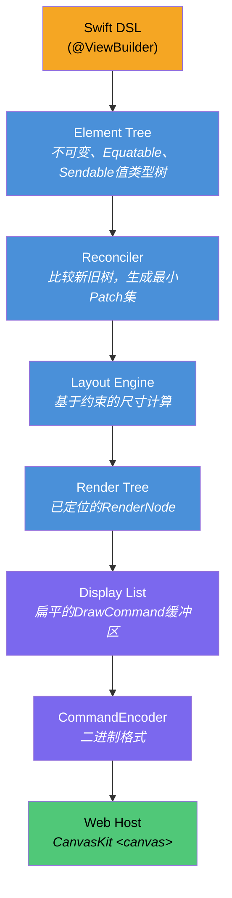
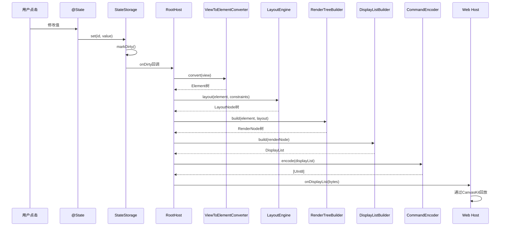
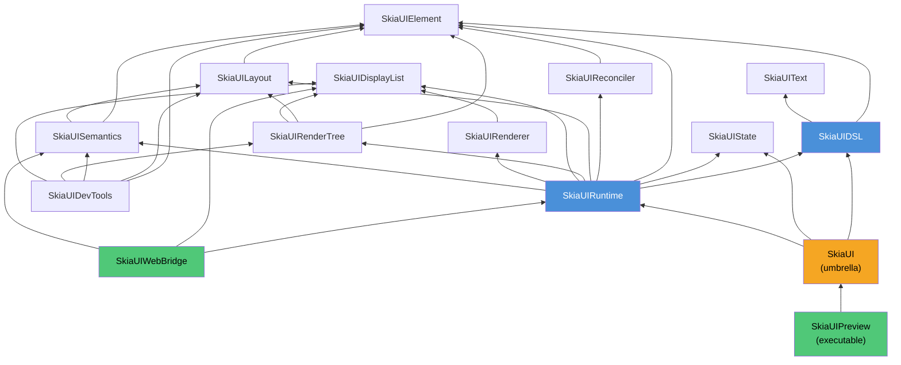

# SkiaUI

用Swift编写的声明式UI引擎。在Web上通过[Skia (CanvasKit)](https://skia.org/docs/user/modules/canvaskit/)进行渲染。编写SwiftUI风格的代码，在HTML Canvas上绘制像素级精确的UI。

**[English](/)** | **[한국어](/ko/)** | **[日本語](/ja/)**

```swift
struct CounterView: View {
    @State private var count = 0

    var body: some View {
        VStack(spacing: 16) {
            Text("Count: \(count)")
                .font(size: 32)
                .foregroundColor(.blue)

            HStack(spacing: 16) {
                Text("- Decrease")
                    .padding(12)
                    .background(.red)
                    .foregroundColor(.white)
                    .onTapGesture { count -= 1 }

                Text("+ Increase")
                    .padding(12)
                    .background(.blue)
                    .foregroundColor(.white)
                    .onTapGesture { count += 1 }
            }
        }
        .padding(32)
    }
}
```

## 为什么选择SkiaUI

Swift开发者要构建Web UI，要么转向JavaScript技术栈，要么接受以DOM为中心的渲染限制。

SkiaUI选择了不同的道路：

- **Swift作为唯一的UI语言** -- 声明式ResultBuilder DSL、`@State`、modifier
- **基于Canvas的渲染** -- 不是DOM元素，而是通过Skia绘图命令直接在`<canvas>`上绘制
- **渲染器无关的核心** -- DSL和布局引擎完全不知道CanvasKit的存在

## 架构

核心设计原则是**声明、计算、绘制的严格分离**。



每一层都是独立的Swift模块，在`Package.swift`中定义了明确的依赖边界。

### 状态变更时的数据流



### 模块依赖图



## 模块映射

```text
SkiaUI (umbrella)
  @_exported import SkiaUIDSL
  @_exported import SkiaUIState
  @_exported import SkiaUIRuntime

SkiaUIDSL           -> [SkiaUIElement, SkiaUIText]
  View协议、@ViewBuilder、PrimitiveView协议
  Primitives:   Text, Rectangle, Spacer, EmptyView
  Containers:   VStack, HStack, ZStack
  Modifiers:    padding, frame, background, foregroundColor, font,
                onTapGesture, accessibilityLabel/Role/Hint/Hidden
```

核心模块无外部依赖。`JavaScriptKit`仅在WebAssembly构建时由`SkiaUIWebBridge`使用。

## 核心设计决策

### Element：设计为indirect enum

```swift
public indirect enum Element: Equatable, Sendable {
    case empty
    case text(String, TextProperties)
    case rectangle(RectangleProperties)
    case spacer(minLength: Float?)
    case container(ContainerProperties, children: [Element])
    case modified(Element, Modifier)
}
```

整个UI树是一个单一的值类型`Equatable`结构。

### 基于约束的布局

```swift
public protocol LayoutStrategy: Sendable {
    func layout(children: [Element], constraints: Constraints,
                measure: (Element, Constraints) -> LayoutNode) -> LayoutNode
}
```

每种栈类型实现`LayoutStrategy`。

### 显示列表：渲染边界

显示列表是**跨越Swift-JavaScript边界的唯一数据**。

### 渲染树

`RenderTreeBuilder`同时遍历`Element`树和`LayoutNode`树，生成已定位的`RenderNode`。

### Reconciler

`ElementPath`以`[Int]`索引编码树位置。`DirtyTracker`标记路径及其祖先以执行目标re-layout。

### 响应式状态

`@State`由全局`StateStorage`（基于`NSLock`的线程安全）支撑。

### ViewBuilder (SE-0348)

使用`buildPartialBlock`（SE-0348）支持无限子元素。

## DSL接口

### 基本视图

| 视图 | 描述 |
| ---- | ---- |
| `Text("Hello")` | 带样式的文本节点 |
| `Rectangle()` | 纯色或圆角矩形 |
| `Spacer()` | 栈内弹性空间 |
| `EmptyView()` | 零尺寸占位符 |

### 容器

| 视图 | 描述 |
| ---- | ---- |
| `VStack(alignment:spacing:)` | 垂直布局 |
| `HStack(alignment:spacing:)` | 水平布局 |
| `ZStack(alignment:)` | 叠加/层叠布局 |

### View modifier

| Modifier | 示例 |
| -------- | ---- |
| `.padding(_:)` | `.padding(16)` |
| `.frame(width:height:)` | `.frame(width: 200, height: 100)` |
| `.background(_:)` | `.background(.blue)` |
| `.foregroundColor(_:)` | `.foregroundColor(.white)` |
| `.font(size:weight:)` | `.font(size: 24, weight: .bold)` |
| `.onTapGesture { }` | `.onTapGesture { count += 1 }` |
| `.accessibilityLabel(_:)` | `.accessibilityLabel("关闭按钮")` |

### Rectangle专用modifier

| Modifier | 示例 |
| -------- | ---- |
| `.fill(_:)` | `Rectangle().fill(.red)` |
| `.cornerRadius(_:)` | `Rectangle().fill(.orange).cornerRadius(12)` |

### 类型

| 类型 | 值 |
| ---- | -- |
| `Color` | `.red`, `.blue`, `.green`, `.orange`, `.purple`, `.yellow`, `.gray`, `.black`, `.white`, `.clear` |
| `FontWeight` | `.ultraLight`, `.thin`, `.light`, `.regular`, `.medium`, `.semibold`, `.bold`, `.heavy`, `.black` |

## Web Host

TypeScript Web主机（`WebHost/`）被有意设计得很薄。它只是一个显示列表播放器。

## 快速开始

### 前提条件

- Swift 6.2+
- macOS 14.0+
- Node.js / pnpm

### 构建与运行

```bash
swift build
swift test
swift run SkiaUIPreview
cd WebHost && pnpm install && pnpm dev
```

在浏览器中打开`http://localhost:5173`。

## 项目状态

SkiaUI处于早期开发阶段。

- [x] 基于`@ViewBuilder`的ResultBuilder DSL
- [x] 4个基本视图
- [x] 3个容器视图
- [x] 10个view modifier + 2个Rectangle专用modifier
- [x] `@State`响应性与自动重新渲染
- [x] 基于约束的布局引擎
- [x] 基于最小diff的树协调
- [x] 二进制显示列表编码/解码
- [x] CanvasKit Web渲染
- [x] Z-order正确命中测试
- [x] 无障碍语义树

### 路线图

- [ ] ScrollView / List
- [ ] 动画系统
- [ ] 图片支持
- [ ] 键盘 / 焦点管理
- [ ] 无障碍DOM覆盖层
- [ ] 原生Skia后端（Metal / Vulkan）
- [ ] Hot reload

## 许可证

MIT
