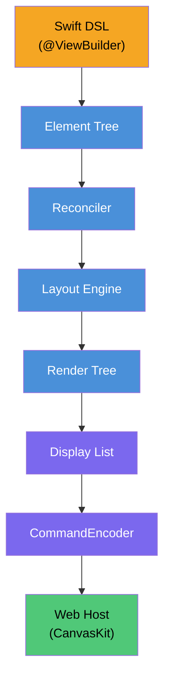

<p align="center">
  
</p>

# SkiaUI

A declarative UI engine written in Swift that renders to [Skia (CanvasKit)](https://skia.org/docs/user/modules/canvaskit/) on the web.

Write SwiftUI-style code, render pixel-perfect UI on an HTML `<canvas>`.

**[한국어](Docs/README_ko.md)** | **[日本語](Docs/README_ja.md)** | **[中文](Docs/README_zh.md)** | **[Documentation](https://devyhan.github.io/SkiaUI/)**

> [!IMPORTANT]
> SkiaUI is currently in an **experimental stage**. APIs are unstable and may change without notice. Not recommended for production use.

```swift
import SkiaUI

struct CounterView: View {
    @State private var count = 0

    var body: some View {
        VStack(spacing: 16) {
            Text("Count: \(count)")
                .font(size: 32)
                .foregroundColor(.blue)

            HStack(spacing: 16) {
                Text("- Decrease")
                    .padding(12)
                    .background(.red)
                    .foregroundColor(.white)
                    .onTapGesture { count -= 1 }

                Text("+ Increase")
                    .padding(12)
                    .background(.blue)
                    .foregroundColor(.white)
                    .onTapGesture { count += 1 }
            }
        }
        .padding(32)
    }
}
```

## Goals

- **Swift as the single UI language** -- declarative ResultBuilder DSL, `@State`, modifiers
- **Canvas-based rendering** -- Skia drawing commands on `<canvas>`, not DOM elements
- **Renderer-agnostic core** -- a native Skia or Metal backend can be added without changing user code

## Architecture



Each layer is a separate Swift module. The binary display list is the **only thing that crosses the Swift–JavaScript boundary** — zero JSON, zero object marshalling.

## Feature Status

| Category | Feature | Status |
| -------- | ------- | ------ |
| **Views** | Text, Rectangle, Spacer, EmptyView | Done |
| **Containers** | VStack, HStack, ZStack, ScrollView | Done |
| **Modifiers** | padding, frame, background, foregroundColor, font, fontFamily, onTapGesture, drawingGroup | Done |
| **Typography** | Font struct (.custom, .system, semantic styles), fontFamily pipeline, FontManager | Done |
| **Layout** | ProposedSize negotiation, layoutPriority, fixedSize, flexible frame (min/ideal/max) | Done |
| **State** | @State, Binding, automatic re-rendering, incremental evaluation (AttributeGraph) | Done |
| **Accessibility** | accessibilityLabel, accessibilityRole, accessibilityHint, accessibilityHidden | Done |
| **Rendering** | Binary display list, CanvasKit replay, retained subtrees, pipeline optimizations | Done |
| **Reconciler** | Tree diff, Patch, DirtyTracker, RootHost integration | Done |
| **Testing** | 21 test suites, 161 tests | Done |
| **Rendering** | List | Planned |
| **Rendering** | Animation system | Planned |
| **Rendering** | Image support | Planned |
| **Platform** | Native Skia backend (Metal / Vulkan) | Planned |

## Products

| Product | Description |
| ------- | ----------- |
| **SkiaUI** | Umbrella module — `import SkiaUI` to access all DSL, state, and runtime APIs |
| **SkiaUIWebBridge** | JavaScriptKit interop layer for WebAssembly builds (isolated dependency) |
| **SkiaUIDevTools** | TreeInspector, DebugOverlay, SemanticsInspector for development |

## Getting Started

### Requirements

- Swift 6.2+
- macOS 14.0+
- Node.js / pnpm (for WebClient)

### Build & Test

```bash
# Build all modules
swift build

# Run tests
swift test
```

### Quick Start (WASM)

Deploy a SkiaUI app directly to the browser via WebAssembly in 4 steps:

**1. Copy the example project**

```bash
cp -r Examples/BasicApp ~/MySkiaUIApp
cd ~/MySkiaUIApp
```

**2. Build**

```bash
# Build the project (defaults to dist/ folder)
swift run skia build --product App
```

**3. Serve**

To serve your app, see the [Server Integration](#server-integration) section below for a complete Vapor example.

> See [`Examples/BasicApp/`](Examples/BasicApp/) for the complete example project.

## Server Integration

SkiaUI can be seamlessly integrated with [Vapor](https://vapor.codes) to serve your WASM app.

**1. Build for Vapor**

Run the build tool and specify Vapor's public directory:

```bash
swift run skia build --product App --output Public
```

**2. Run Vapor Server**

Ensure your Vapor app is configured to serve static files from `Public/`, then start the server:

```bash
swift run App
```

**3. Vapor Configuration**

In your `configure.swift`:

```swift
import Vapor

public func configure(_ app: Application) throws {
    // Serve files from the Public/ directory
    app.middleware.use(FileMiddleware(publicDirectory: app.directory.publicDirectory))
    
    // ...
}
```


## Known Limitations

- Text rendering relies on estimated glyph widths (`fontSize × 0.6 × charCount`), not real font metrics
- No text wrapping or line breaking — single-line text only
- No gesture recognizers beyond `onTapGesture`
- No keyboard input or focus management
- No image loading or rendering
- No animation or transition support

## License

MIT — see [LICENSE](LICENSE) for details.

Third-party licenses are listed in [THIRD_PARTY_NOTICES](THIRD_PARTY_NOTICES).

## Disclaimer

SwiftUI is a trademark owned by Apple Inc. This project is not affiliated with, endorsed by, or connected to Apple Inc. in any way.
